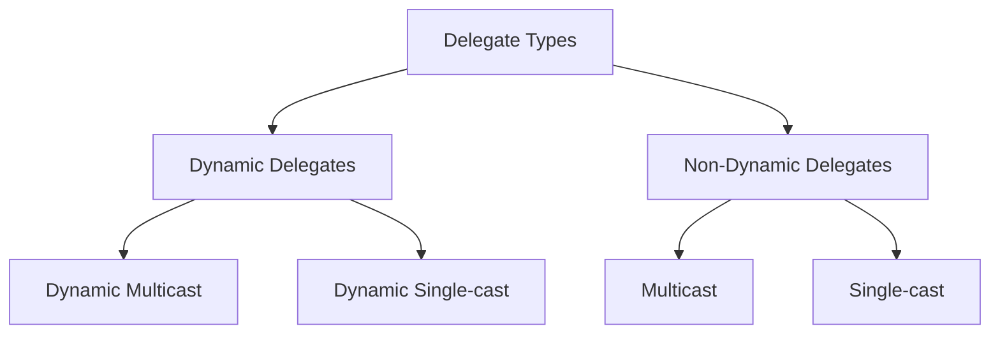
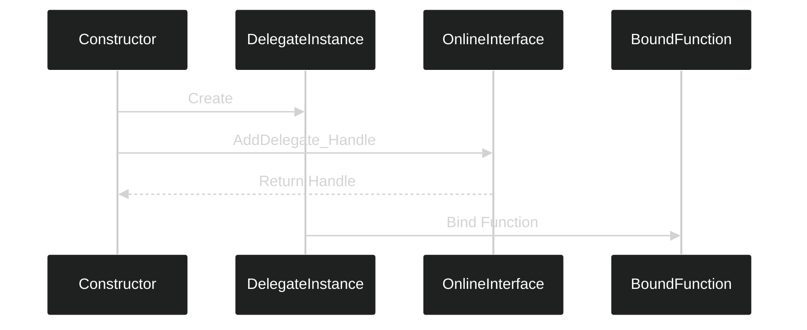
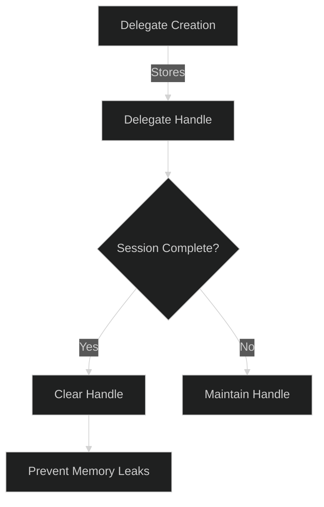

# Technical Implementation of Delegates in Unreal Engine Multiplayer

## Core Technical Concepts

A delegate in Unreal Engine's multiplayer system serves as a type-safe function pointer container that can execute member functions of a specified class. The system uses macro-based code generation to create necessary binding infrastructure.



## Implementation Structure

### Global Scope Declaration
```cpp
// Must be at global scope for macro expansion
DECLARE_DYNAMIC_MULTICAST_DELEGATE_OneParam(FMultiplayerOnCreateSessionComplete, bool, bWasSuccessful);
```

### Class Member Declaration
```cpp
class UMultiplayerSessionsSubsystem : public UGameInstanceSubsystem {
    // Delegate instance
    FMultiplayerOnCreateSessionComplete MultiplayerOnCreateSessionComplete;
    
    // Handle for Online Subsystem delegate
    FDelegateHandle CreateSessionCompleteDelegateHandle;
};
```

## Delegate Binding Process



## Technical Workflow

1. Delegate Declaration:
   - Macro expansion creates delegate type
   - Generates binding infrastructure
   - Creates broadcast infrastructure

2. Instance Creation:
   - Subsystem holds delegate instance
   - Maintains delegate handle for cleanup
   - Manages lifetime of binding

3. Binding Process:
   ```cpp
   // In constructor
   CreateSessionCompleteDelegate = FOnCreateSessionCompleteDelegate::CreateUObject(
       this, 
       &ThisClass::OnCreateSessionComplete
   );
   ```

4. Handle Management:
   ```cpp
   // Store handle for cleanup
   CreateSessionCompleteDelegateHandle = SessionInterface->AddOnCreateSessionCompleteDelegate_Handle(
       CreateSessionCompleteDelegate
   );
   ```

## Memory Management Considerations

