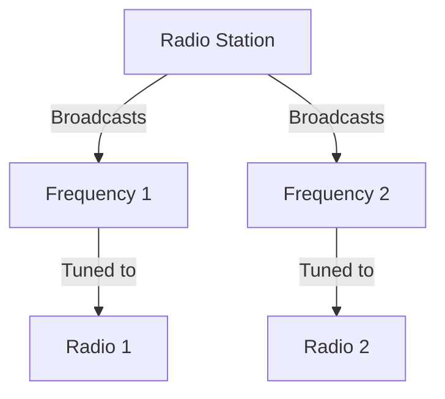

# Understanding Delegates: The Radio Station Analogy

Think of delegates like a radio broadcasting system. Here's how it works:

## The Radio Broadcasting System

1. **The Setup**
   - The Radio Station (Multiplayer Subsystem) broadcasts on specific frequencies
   - Your Radio (Menu Class) tunes to those frequencies
   - Each frequency (Delegate) carries specific types of messages

2. **How It Works**
   - The Station doesn't need to know who's listening
   - Multiple radios can tune in (Multicast)
   - Each frequency carries specific types of information
   - Radios only receive what they're tuned to

In our multiplayer system:
- The Subsystem (Radio Station) broadcasts session status
- The Menu (Radio) tunes in to hear about session creation
- The Delegate (Frequency) carries the success/failure message

Just like you don't need to call the radio station to check if your favorite song is playing, the Menu doesn't need to constantly check if the session is ready - it just gets notified automatically when something happens.

The real power, just like with radio, is that:
- One broadcaster can reach many listeners
- Listeners can tune in or out as needed
- The system works without the broadcaster needing to know who's listening