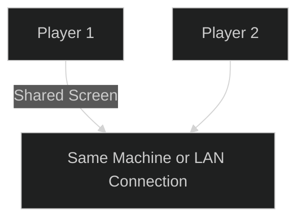
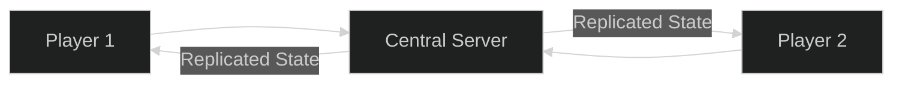
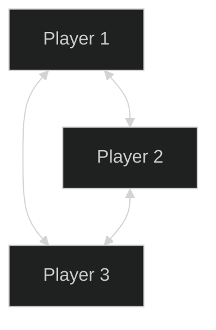
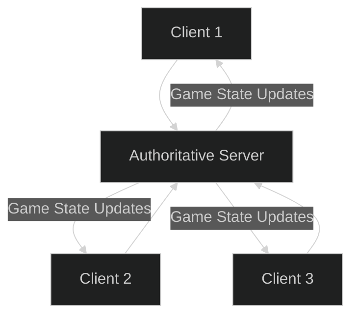
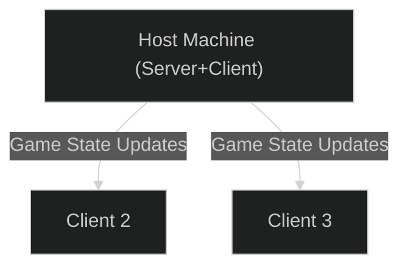
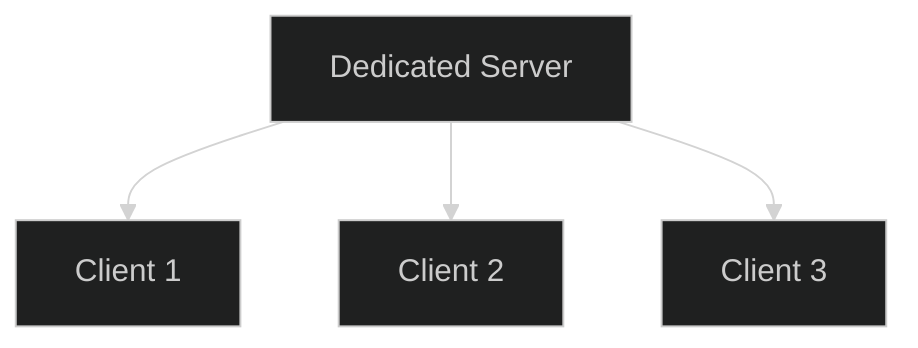
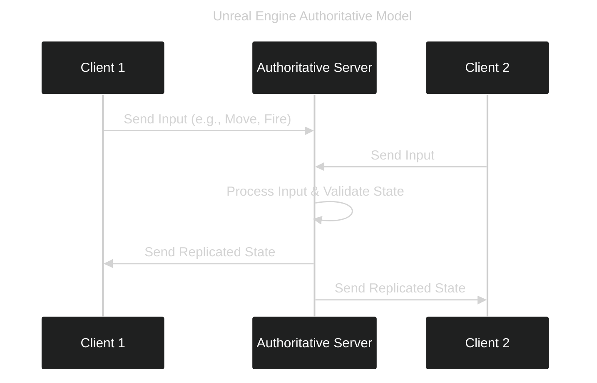

---
tags:
  - multiplayer
  - local_lan
  - online_multiplayer
Date: 2024-12-15
---
# Multiplayer Types

This document outlines different multiplayer models, their characteristics, and approaches.  

---

## #Local_LAN

- Traditional **split\_screen** gameplay
- Does not require internet
- Extremely low latency

**Pros:** Simple setup, no external network required.  
**Cons:** Limited to local players.

---

## Online Multiplayer ("True" Multiplayer)

Requires `#internet` connection.  
At least two instances running on separate machines.  
Movement must be **replicated** across all clients.

**Key Challenge:** Synchronizing game state over the network.

Replicate positions, actions, states!

---

### #Peer-to-Peer

- Each player sends updates directly to every other player.
- Relatively easy to implement for a small number of players.
- Scales poorly (as you add more players, each must send to everyone else).
- No **authoritative** version of the game state.

**Pros:** Easy initial setup.  
**Cons:** Complexity grows with player count, no single source of truth.

---

### #Client-Server Model

1. One machine acts as the **#server** (authoritative source).
2. All other machines are **clients**.
3. All game state flows through the server.

**Pros:**

- Scales better.
- Clear authoritative version of the game state.
- Easier to implement anti-cheat and moderation.

**Cons:**

- Requires hosting a server.
- Server failure stops the game.

---

#### #Listen_Server

A player’s machine acts as both server and client, rendering the game while hosting it.

**Pros:** Host enjoys minimal latency.  
**Cons:** Host advantage, session ends if host leaves.

---

#### #Dedicated_Server

A machine solely running the server process with no players on it.

**Pros:**

- Equal playing field for all clients.
- Stable environment, often in a data center.

**Cons:**

- Ongoing hosting cost and maintenance.

---

## Unreal Engine & The Authoritative Client-Server Model

In Unreal Engine’s architecture:

- One machine always acts as the **server** (authoritative).
- Other machines connect as **clients**.
- The server’s version of the game state is **law**.

**Benefits:**

- Built-in replication handling.
- Reduces cheating.
- Centralized state management.

