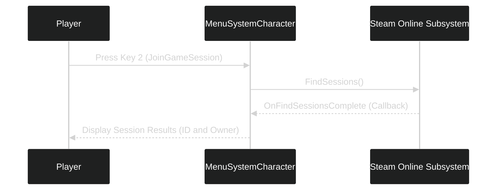

---
tags:
  - cpp
  - delegates
  - online_subsystem
  - steam
Date: 2024-12-16
---
# Unreal Engine: Finding and Joining Game Sessions

In this lecture, we will implement functionality for **finding** and **joining game sessions** using the **Online Subsystem**. We'll also demonstrate how to set up delegates for session discovery and callbacks.

---

## Key Workflow for Finding Sessions

1. **Bind a Delegate** to handle the session search completion (`FOnFindSessionsCompleteDelegate`).
2. Create a **Callback Function** (`OnFindSessionsComplete`) to handle the results.
3. Use the **`FindSessions()`** function to search for available sessions.
4. Loop through the session results and display relevant information.

---

## Step 1: Add the Function and Delegate

In **`MenuSystemCharacter.h`**, add a **BlueprintCallable** function and declare the necessary delegate.

```cpp
#include "OnlineSubsystem.h"
#include "OnlineSessionSettings.h"

public:
    // Pointer to the online session interface
    IOnlineSessionPtr OnlineSessionInterface;

    UFUNCTION(BlueprintCallable)
    void JoinGameSession();

protected:
    void OnFindSessionsComplete(bool bWasSuccessful);

private:
    FOnFindSessionsCompleteDelegate FindSessionsCompleteDelegate;
    TSharedPtr<class FOnlineSessionSearch> SessionSearch;
```
---

## Step 2: Initialize the Delegate

In the **constructor** of `MenuSystemCharacter.cpp`, bind the `OnFindSessionsComplete` callback to the delegate.
```cpp
AMenuSystemCharacter::AMenuSystemCharacter() :
    CreateSessionCompleteDelegate(FOnCreateSessionCompleteDelegate::CreateUObject(this, &ThisClass::OnCreateSessionComplete)),
    FindSessionsCompleteDelegate(FOnFindSessionsCompleteDelegate::CreateUObject(this, &ThisClass::OnFindSessionsComplete))
{
    IOnlineSubsystem* OnlineSubsystem = IOnlineSubsystem::Get();
    if (OnlineSubsystem)
    {
        OnlineSessionInterface = OnlineSubsystem->GetSessionInterface();
        UE_LOG(LogTemp, Warning, TEXT("Found Subsystem: %s"), *OnlineSubsystem->GetSubsystemName().ToString());
    }
    else
    {
        UE_LOG(LogTemp, Error, TEXT("No Online Subsystem Found!"));
    }
}

```
---

## Step 3: Implement `JoinGameSession`

In **`MenuSystemCharacter.cpp`**, implement the **session search logic** with appropriate settings.

```cpp
void AMenuSystemCharacter::JoinGameSession()
{
    // Check if the session interface is valid
    if (!OnlineSessionInterface.IsValid()) { return; }

    // Bind the delegate to handle session search completion
    OnlineSessionInterface->AddOnFindSessionsCompleteDelegate_Handle(FindSessionsCompleteDelegate);

    // Configure the session search
    SessionSearch = MakeShareable(new FOnlineSessionSearch());
    SessionSearch->MaxSearchResults = 100000; // High number to handle shared Dev App ID
    SessionSearch->bIsLanQuery = false; // Online search

    // Query sessions using presence
    SessionSearch->QuerySettings.Set(SEARCH_PRESENCE, true, EOnlineComparisonOp::Equals);

    // Start the search
    const ULocalPlayer* LocalPlayer = GetWorld()->GetFirstLocalPlayerFromController();
    OnlineSessionInterface->FindSessions(*LocalPlayer->GetPreferredUniqueNetId(), SessionSearch.ToSharedRef());
}

```
---

## Step 4: Handle Session Search Results

Implement the **callback function** to iterate over the search results and display them.

```cpp
void AMenuSystemCharacter::OnFindSessionsComplete(bool bWasSuccessful)
{
    if (bWasSuccessful)
    {
        for (auto Result : SessionSearch->SearchResults)
        {
            FString Id = Result.GetSessionIdStr();
            FString User = Result.Session.OwningUserName;

            if (GEngine)
            {
                GEngine->AddOnScreenDebugMessage(-1, 15.f, FColor::Yellow,
                    FString::Printf(TEXT("Session ID: %s | User: %s"), *Id, *User));
            }
        }
    }
    else
    {
        UE_LOG(LogTemp, Error, TEXT("Failed to find sessions."));
    }
}

```

---

## Summary of Key Concepts

|**Component**|**Purpose**|
|---|---|
|`FOnFindSessionsCompleteDelegate`|Delegate to handle session search completion.|
|`FindSessions()`|Initiates the search for game sessions.|
|`FOnlineSessionSearch`|Configures the search settings, such as LAN or Internet queries.|
|`OnFindSessionsComplete`|Callback function to process and display search results.|

---

## Visual Workflow



