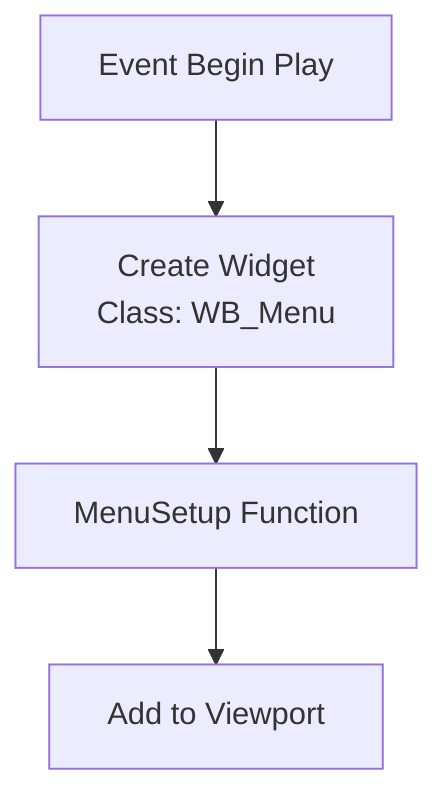

---
tags:
  - widget
  - widgetbp
  - ui_setup
  - multiplayer
Date: 2024-12-17
---
## Overview

In this lecture, we created a **menu class** in C++ and set it as the parent of a **widget blueprint**. This menu allows us to easily create and join multiplayer sessions using host and join buttons.

---

## Key Steps

### Step 1: Creating the Menu Class

1. **New Class Based on `UUserWidget`:**
    
    - Navigate to your plugin’s `Public` folder under `C++ Classes`.
    - Create a new class derived from `UUserWidget`.
    - Name it **`Menu`**.
2. **Add the `MenuSetup` Function:**  
    This function sets up the menu widget, adds it to the viewport, and configures input focus.
    

**Header File (`Menu.h`):**

```cpp
#pragma once

#include "CoreMinimal.h"
#include "Blueprint/UserWidget.h"
#include "Menu.generated.h"

UCLASS()
class MULTIPLAYERSESSIONS_API UMenu : public UUserWidget
{
    GENERATED_BODY()

public:
    UFUNCTION(BlueprintCallable)
    void MenuSetup();
};

```

**Source File (`Menu.cpp`):**
```cpp
#include "Menu.h"

void UMenu::MenuSetup()
{
    AddToViewport();
    SetVisibility(ESlateVisibility::Visible);
    bIsFocusable = true;

    UWorld* World = GetWorld();
    if (World)
    {
        APlayerController* PlayerController = World->GetFirstPlayerController();
        if (PlayerController)
        {
            FInputModeUIOnly InputModeData;
            InputModeData.SetWidgetToFocus(TakeWidget());
            InputModeData.SetLockMouseToViewportBehavior(EMouseLockMode::DoNotLock);
            PlayerController->SetInputMode(InputModeData);
            PlayerController->SetShowMouseCursor(true);
        }
    }
}

```

---

### Step 2: Setting Up UMG Dependencies

Ensure the required modules are enabled in the `MultiplayerSessions.Build.cs` file:

```cpp
PublicDependencyModuleNames.AddRange(
{
    "Core",
    "OnlineSubsystem",
    "OnlineSubsystemSteam",
    "UMG",
    "Slate",
    "SlateCore"
});
```

---

### Step 3: Creating the Widget Blueprint

1. **Create the Widget Blueprint:**
    
    - Go to the **Content Browser** under the plugin’s folder.
    - Create a **Widget Blueprint** and name it **`WB_Menu`**.
2. **Reparent the Widget Blueprint:**
    
    - Open the blueprint and go to **Class Settings**.
    - Set the parent class to `Menu`.
    - This links the blueprint to the C++ menu class.

---

### Step 4: Adding Host and Join Buttons

1. **UI Setup in Designer Tab:**
    
    - Add two buttons: **`HostButton`** and **`JoinButton`**.
    - Anchor the buttons to the **bottom-middle** for consistency.
2. **Add Text Widgets for Button Labels:**
    
    - Name the text widgets `HostText` and `JoinText`.
    - Set their content to **Host** and **Join**, respectively.
3. **Button Positioning:**
    

|**Element**|**X Position**|**Y Position**|**Size (X, Y)**|
|---|---|---|---|
|Host Button|`-600`|`-300`|`350, 100`|
|Join Button|`250`|`-300`|`350, 100`|

---

### Step 5: Testing Menu Setup

1. **Use the Menu Widget on Begin Play:**
    - Open the **Level Blueprint**.
    - Call `CreateWidget` to create the `WB_Menu` instance.
    - Call the `MenuSetup` function:

**Blueprint Logic:**



---

## Summary

We have successfully:

1. Created a **Menu C++ class** derived from `UUserWidget`.
2. Added a `MenuSetup` function to configure the widget and input.
3. Created a **Widget Blueprint** and reparented it to the `Menu` class.
4. Added **Host** and **Join** buttons with basic styling and positioning.