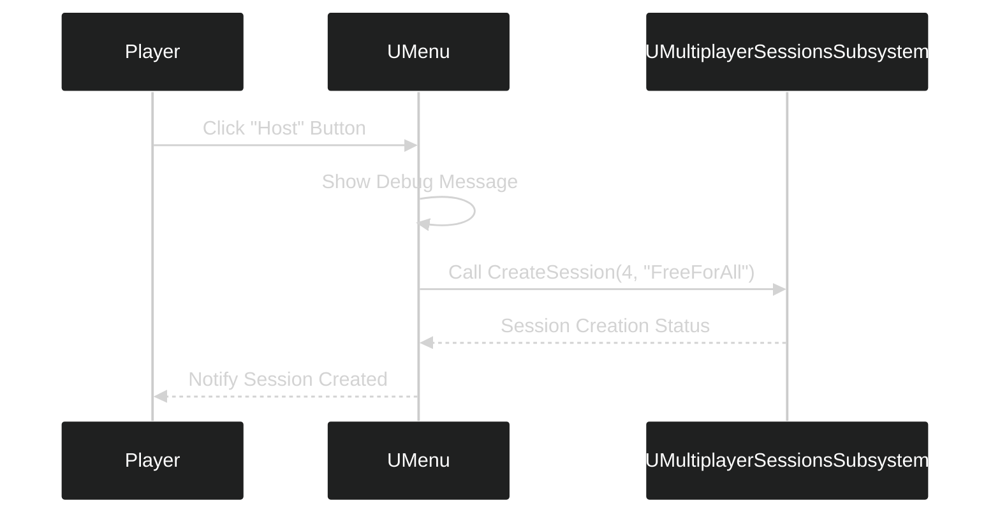

---
tags:
  - multiplayer
  - game_instance_subsystem
  - buttoncallbacks
  - online_subsystem
  - plugins
Date: 2024-12-18
---
# Lecture Notes: Adding Button Callbacks and Accessing the Multiplayer Sessions Subsystem

---

## Overview

In this lecture, we:
- Added button callbacks to respond to menu button clicks.
- Linked C++ variables to UI elements in a widget blueprint.
- Verified button click functionality with debug messages.
- Accessed the Multiplayer Sessions Subsystem from the `Menu` C++ class.

---

## Key Sections

### **1. Adding Button Callbacks**
To handle button clicks in our widget, we needed to:
1. **Create C++ variables** for our widget buttons.
2. **Bind callbacks** to their respective button click events.

---

#### Adding Button Variables
We declared button variables in `Menu.h` and used the `BindWidget` meta specifier to link them to buttons in the widget blueprint.

```cpp
private:
    UPROPERTY(meta = (BindWidget))
    UButton* HostButton;

    UPROPERTY(meta = (BindWidget))
    UButton* JoinButton;
```
**Important**: The C++ variable names must match the widget names in the blueprint.

---

#### Creating Callback Functions

We created callback functions to handle the button clicks:

```cpp
private:
	UFUNCTION()
	void HostButtonClicked();

	UFUNCTION()
	void JoinButtonClicked();
```

**Implementation of `HostButtonClicked`**:

```cpp
void UMenu::HostButtonClicked()
{
    if (GEngine)
    {
        GEngine->AddOnScreenDebugMessage(-1, 15.f, FColor::Orange, TEXT("Host Button Clicked"));
    }

    if (MultiplayerSessionsSubsystem)
    {
        MultiplayerSessionsSubsystem->CreateSession(4, FString("FreeForAll"));
    }
}

```

**Implementation of `JoinButtonClicked`**:

```cpp
void UMenu::JoinButtonClicked()
{
    if (GEngine)
    {
        GEngine->AddOnScreenDebugMessage(-1, 15.f, FColor::Yellow, TEXT("Join Button Clicked"));
    }
}
```

---

#### Binding Callbacks

We used the `Initialize` function to bind the callbacks to button click events:

```cpp
bool UMenu::Initialize()
{
    if (!Super::Initialize()) return false;

    if (HostButton)
    {
        HostButton->OnClicked.AddDynamic(this, &UMenu::HostButtonClicked);
    }

    if (JoinButton)
    {
        JoinButton->OnClicked.AddDynamic(this, &UMenu::JoinButtonClicked);
    }

    return true;
}

```

---

### **2. Accessing the Multiplayer Sessions Subsystem**

The `Menu` class interacts with the **Multiplayer Sessions Subsystem**, which handles session functionality.

#### Adding a Subsystem Pointer

We added a private pointer to `Menu.h`:

```cpp
private:
    UMultiplayerSessionsSubsystem* MultiplayerSessionsSubsystem;

```

---

#### Accessing the Subsystem

The subsystem is retrieved via the game instance and stored in the pointer:

```cpp
void UMenu::MenuSetup()
{
    UGameInstance* GameInstance = GetGameInstance();
    if (GameInstance)
    {
        MultiplayerSessionsSubsystem = GameInstance->GetSubsystem<UMultiplayerSessionsSubsystem>();
    }
}

```
This allows the `Menu` class to call functions like `CreateSession` directly.

---

### **3. Testing and Debugging**

1. **Compile and Test**: After implementing callbacks and bindings, we tested the buttons in the editor.
2. **Regenerate Files**: If buttons didn’t work, we rebuilt the project files.

---

### Diagram: Workflow for Host Button Click



---

## Summary of Changes

1. Added **`HostButtonClicked`** and **`JoinButtonClicked`** callbacks.
2. Linked buttons in the widget blueprint to C++ variables using `BindWidget`.
3. Bound button click events to the callbacks in the `Initialize` function.
4. Accessed the Multiplayer Sessions Subsystem from the `Menu` class.