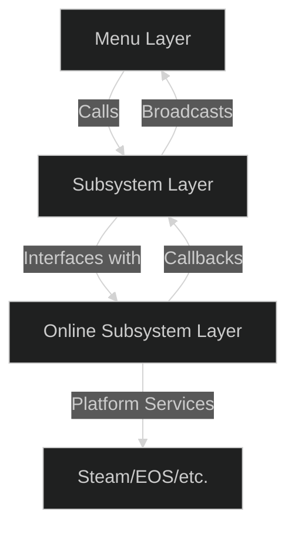
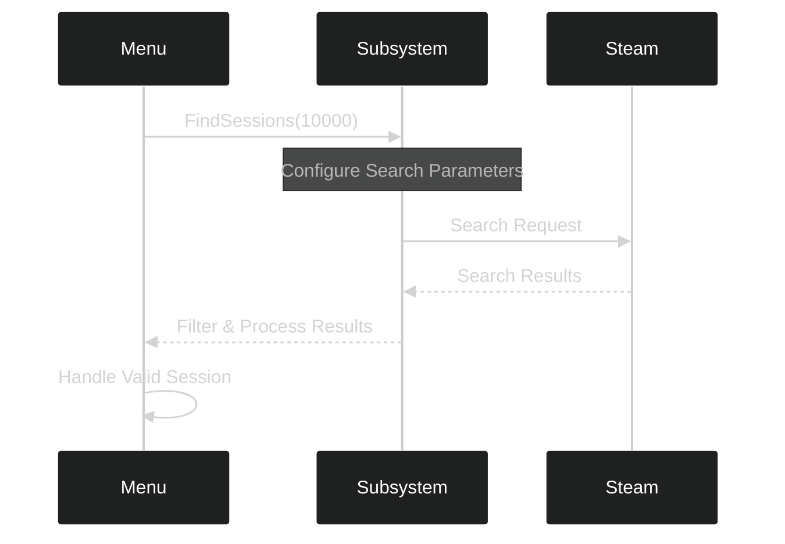
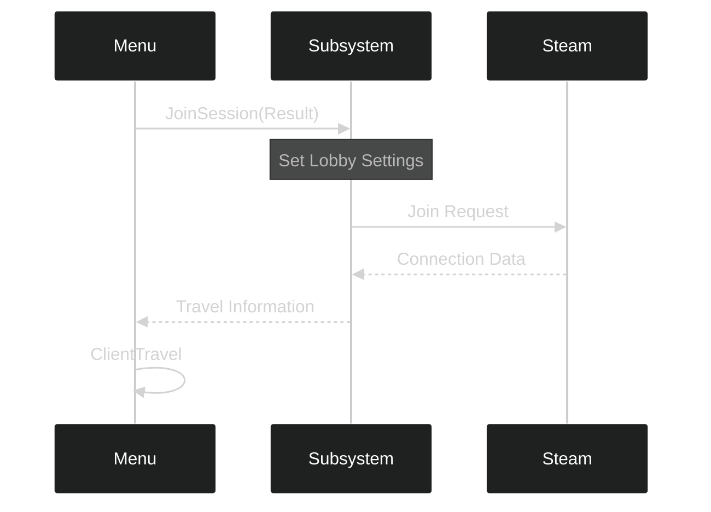

---
tags:
  - online_subsystem
  - multiplayer
  - steam
  - session_management
  - delegates
Date: 2024-12-18
---
# Session Management in Unreal Engine

## Core Components of Session Management

### Subsystem Architecture
The session management system consists of three main layers:
- **Menu Layer** - User interface and initial input handling
- **Subsystem Layer** - Business logic and session management
- **Online Subsystem Layer** - Platform-specific networking (Steam, EOS, etc.)



---

## Key Systems Overview

### 1. Session Finding Process

When a player clicks "Join":


---

### 2. Session Joining Process

After finding a valid session:


---

## Critical UE5 Bug Fix

In UE5, there's a critical bug regarding lobby availability. The fix involves:

```cpp
// In Menu.cpp - OnFindSessions
Result.Session.SessionSettings.bUseLobbiesIfAvailable = true;
```

```cpp
void UMenu::OnFindSessions(const TArray<FOnlineSessionSearchResult>& SessionResults, bool bWasSuccessful)
{
    if (MultiplayerSessionsSubsystem == nullptr) { return; }
    
    for (auto Result : SessionResults)
    {
        FString SettingsValue;
        Result.Session.SessionSettings.Get(FName("MatchType"),SettingsValue);
        if (SettingsValue == MatchType)
        {
            Result.Session.SessionSettings.bUseLobbiesIfAvailable = true; // This line is a bug fix
            MultiplayerSessionsSubsystem->JoinSession(Result);
            return;
        }
    }

    if (!bWasSuccessful || SessionResults.Num() == 0)
    {
        JoinButton->SetIsEnabled(true);
    }
}
```

This is necessary because:
1. Steam's modern multiplayer uses a lobby-based system
2. The flag sometimes gets reset during session transport
3. Without this flag, joining fails silently
4. Setting it ensures proper lobby creation on Steam's backend

---

## Implementation Details

### Session Finding (MultiplayerSessionsSubsystem.cpp)
```cpp
void UMultiplayerSessionsSubsystem::FindSessions(int32 MaxSearchResults)
{
    // Validate session interface
    if (!SessionInterface.IsValid()) { return; }

    // Add delegate to handle completion
    FindSessionsCompleteDelegateHandle = 
        SessionInterface->AddOnFindSessionsCompleteDelegate_Handle(FindSessionsCompleteDelegate);

    // Configure search parameters
    LastSessionSearch = MakeShareable(new FOnlineSessionSearch());
    LastSessionSearch->MaxSearchResults = MaxSearchResults;
    LastSessionSearch->bIsLanQuery = IOnlineSubsystem::Get()->GetSubsystemName() == "NULL" ? true : false;
    
    // Set up presence-based searching
    LastSessionSearch->QuerySettings.Set(SEARCH_PRESENCE, true, EOnlineComparisonOp::Equals);

    // Begin search operation
    const ULocalPlayer* LocalPlayer = GetWorld()->GetFirstLocalPlayerFromController();
    if(!SessionInterface->FindSessions(*LocalPlayer->GetPreferredUniqueNetId(), 
        LastSessionSearch.ToSharedRef()))
    {
        // Handle failure
        SessionInterface->ClearOnFindSessionsCompleteDelegate_Handle(
            FindSessionsCompleteDelegateHandle);
        MultiplayerOnFindSessionsComplete.Broadcast(TArray<FOnlineSessionSearchResult>(), false);
    }
}
```
---

### Understanding the Different Delegate Types

1. **Online System Delegates**:
```cpp
FOnFindSessionsCompleteDelegate FindSessionsCompleteDelegate;
FDelegateHandle FindSessionsCompleteDelegateHandle;
```
These interface with Steam/EOS directly.

2. **Custom Broadcast Delegates**:
```cpp
DECLARE_MULTICAST_DELEGATE_TwoParams(FMultiplayerOnFindSessionsComplete, 
    const TArray<FOnlineSessionSearchResult>&, bool);
```
These communicate from subsystem to menu.

---

## Session Management Best Practices

1. **Always Clean Up Delegates**
```cpp
void UMultiplayerSessionsSubsystem::OnFindSessionComplete(bool bWasSuccessful)
{
    if (SessionInterface)
    {
        SessionInterface->ClearOnFindSessionsCompleteDelegate_Handle(
            FindSessionsCompleteDelegateHandle);
    }
}
```

2. **Validate Session Match Type**
```cpp
FString SettingsValue;
Result.Session.SessionSettings.Get(FName("MatchType"), SettingsValue);
if (SettingsValue == MatchType)
{
    // Valid session found
}
```
---

## Common Pitfalls and Solutions

1. **Session Not Found**
   - Ensure Steam is running
   - Verify same Steam region
   - Check `bUseLobbiesIfAvailable` flag

2. **Join Failures**
   - Validate session settings
   - Ensure proper delegate cleanup
   - Verify network connectivity

3. **Delegate Management**
   - Always clear handles after use
   - Maintain proper binding order
   - Watch for dangling references

---

## Steam Integration Notes

1. **Region Handling**
   - Sessions are region-locked
   - Players must be in same region
   - Access through Steam settings

2. **Development App ID**
   - Using ID 480 (Spacewar)
   - Shared with other developers
   - Consider filtering results carefully

---
