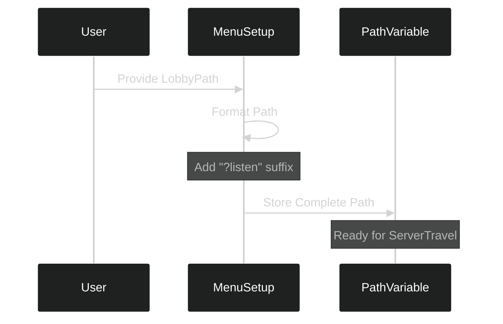

---
tags:
  - plugins
  - unreal_engine
  - menu_system
  - path_configuration
Date: 2024-12-19
---
# Making Plugins Flexible: Configurable Path Systems

## Understanding the Need for Flexibility

When developing plugins, hard-coding paths creates limitations. Imagine building a house with the furniture permanently fixed in place - it might work for one family, but becomes problematic when others want to use the space differently. Similarly, our menu system needs to be adaptable to different project structures.

---

## The Evolution of Our Menu System

Let's visualize how our menu system evolves from rigid to flexible:


This change allows our plugin to work with any project structure, not just the default Third Person template.

---

## Implementation Details

### Previous Approach vs New Approach

| Aspect                | Before                | After                 | Benefit     |
| --------------------- | --------------------- | --------------------- | ----------- |
| Path Storage          | Hard-coded string     | Class member variable | Reusability |
| Configuration         | Fixed at compile time | Runtime parameter     | Flexibility |
| Project Compatibility | Limited               | Universal             | Wider usage |

### Code Implementation

The key changes happen in three places:

1. **Header Declaration**:
```cpp
// In Menu.h
private:
    FString PathToLobby{TEXT("")};  // Empty by default
```

2. **MenuSetup Function**:
```cpp
void UMenu::MenuSetup(
    int32 NumberOfPublicConnections = 4, 
    FString TypeOfMatch = FString(TEXT("FreeForAll")),
    FString LobbyPath = FString(TEXT("/Game/ThirdPerson/Maps/Lobby"))
)
{
    // Construct the full path with listen option
    PathToLobby = FString::Printf(TEXT("%s?listen"), *LobbyPath);
    // ... rest of setup
}
```

3. **Usage in Travel**:
```cpp
void UMenu::OnCreateSession(bool bWasSuccessful)
{
    if (bWasSuccessful && World)
    {
        World->ServerTravel(PathToLobby);
    }
}
```

---

## Understanding the Path Construction

Let's visualize how the path is constructed:



The path construction happens in two stages:
1. Base path provided by the user
2. Necessary options appended automatically

---

## Practical Usage

### Example Project Structures

```
Project A
└── Content/
    └── Levels/
        └── MainLobby

Project B
└── Content/
    └── MultiplayerMaps/
        └── WaitingRoom
```

Both structures can now be accommodated with different path parameters:
- `/Game/Levels/MainLobby`
- `/Game/MultiplayerMaps/WaitingRoom`

### Testing the Flexibility

To demonstrate this flexibility:

1. Create a new level (e.g., "StartingMap")
2. Save it in a custom location
3. Configure the path in MenuSetup:
```cpp
MenuSetup(4, "FreeForAll", "/Game/Maps/StartingMap")
```

---

## Best Practices for Plugin Development

From this implementation, we learn several key principles:

1. **Avoid Hard-coding**
   - Make paths configurable
   - Use default values for convenience

2. **Provide Sensible Defaults**
   - Default to common structures
   - Allow easy overrides

3. **User-Friendly Design**
   - Hide complexity (like ?listen parameter)
   - Clear parameter names

Remember: Good plugins should work without requiring users to understand their internal workings!