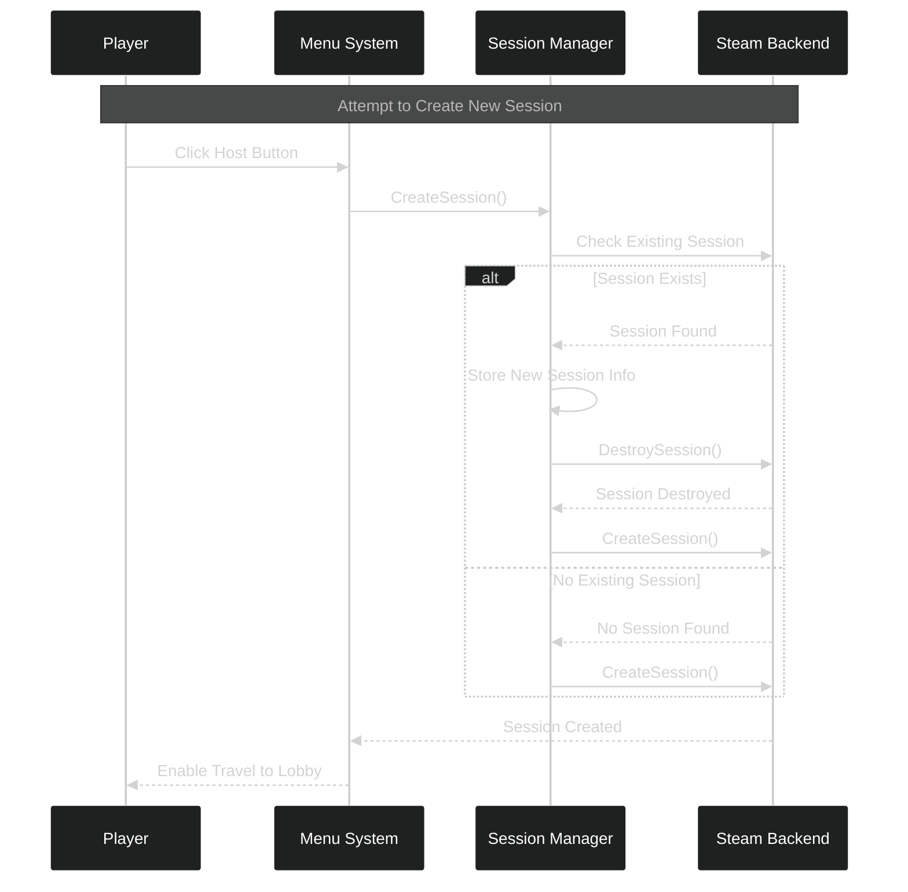
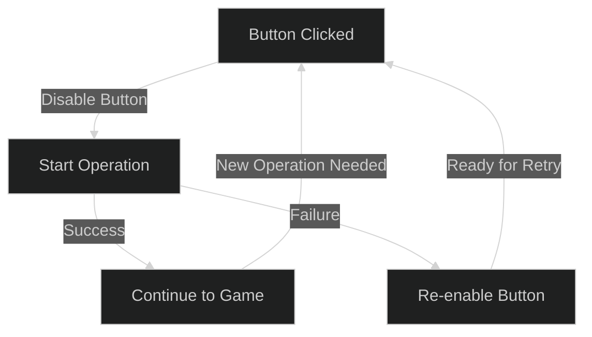

---
tags:
  - ui_setup
  - menu_system
  - session_management
Date: 2024-12-19
---
# Polishing the Menu System: Session Management and UI Improvements

## The Restaurant Host Problem: Understanding Session Management

Think of our multiplayer system like a restaurant with multiple locations. When a host at one location closes their restaurant (destroying a session), we need to make sure all the paperwork is complete before opening a new location (creating a new session). If we try to open the new location too quickly, we'll run into administrative problems.

---

## Session Management Flow

Let's visualize how our improved session handling works:



This diagram shows how we handle the common scenario where a player tries to host when a session already exists. Let's break down each step:

---

## Key Components Implementation

### 1. Session Creation with Safety Checks

```cpp
void UMultiplayerSessionsSubsystem::CreateSession(int32 NumPublicConnections, FString MatchType)
{
    if (!SessionInterface.IsValid()) { return; }

    auto ExistingSession = SessionInterface->GetNamedSession(NAME_GameSession);
    if (ExistingSession != nullptr)
    {
        // Store information for recreating session after destruction
        bCreateSessionOnDestroy = true;
        LastNumPublicConnections = NumPublicConnections;
        LastMatchType = MatchType;
        DestroySession();
    }
    // ... continue with session creation
}
```

Think of this like checking if a restaurant location is already open before trying to open a new one. If it is, we:
1. Remember what kind of restaurant we want to open (LastMatchType)
2. How many tables we need (LastNumPublicConnections)
3. Close the existing location properly before opening the new one

---

## Button Management System

Just like a restaurant's reservation system shouldn't allow double-booking, our menu buttons shouldn't allow multiple actions at once. Here's how we manage this:



### Implementation:
```cpp
void UMenu::HostButtonClicked()
{
    HostButton->SetIsEnabled(false);  // Prevent multiple clicks
    if (MultiplayerSessionsSubsystem)
    {
        MultiplayerSessionsSubsystem->CreateSession(NumPublicConnections, MatchType);
    }
}
```

---

## Error Recovery and State Management

When things go wrong (like failed connections), we need graceful recovery:

| Scenario               | Action                | Recovery                |
| ---------------------- | --------------------- | ----------------------- |
| Session Creation Fails | Re-enable Host Button | Allow retry             |
| No Sessions Found      | Re-enable Join Button | Allow new search        |
| Join Attempt Fails     | Re-enable Join Button | Allow alternative joins |

---

## Quit Game Implementation

For clean exit functionality, we added a simple but effective quit button:
- Located in top-right corner
- Uses built-in quit game functionality
- No need for complex C++ implementation

```cpp
// Blueprint Implementation
// OnClick Event -> QuitGame node
```

---

## Best Practices We've Implemented

1. **Always Clean Up**
   - Destroy old sessions before creating new ones
   - Clear delegates after use
   - Re-enable buttons after failures

2. **User Feedback**
   - Disable buttons during operations
   - Visual feedback for actions
   - Clear error messaging

3. **State Management**
   - Track session creation state
   - Store session parameters for recreation
   - Handle all possible failure cases