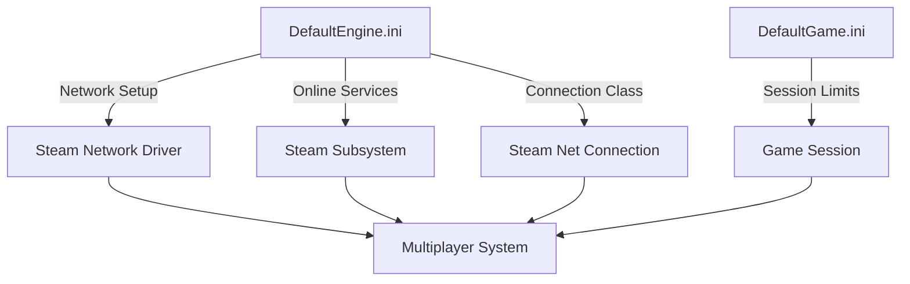
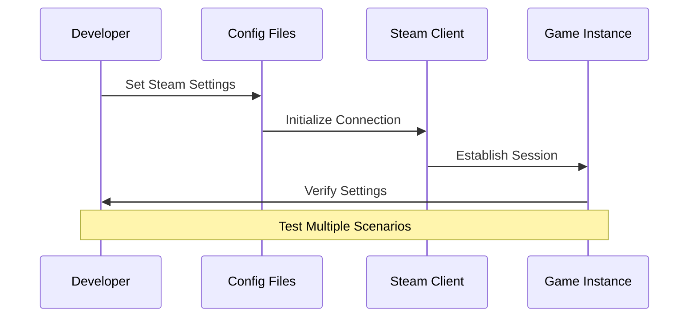

---
tags:
  - steam
  - online_subsystem
  - multiplayer
  - pacakage_deployment
  - networking
  - build_configuration
  - steam_regions
  - session_management
Date: 2024-12-20
---
# Understanding Steam Configuration Files for Unreal Engine Multiplayer

---

## Introduction

The configuration of Steam multiplayer in Unreal Engine requires careful setup of two primary configuration files: `DefaultEngine.ini` and `DefaultGame.ini`. These files contain essential settings that determine how your game interfaces with Steam's networking infrastructure and manages multiplayer sessions.

---

## DefaultEngine.ini Breakdown

Let's examine each crucial section for Steam integration:

### Network Driver Configuration

```ini
[/Script/Engine.GameEngine]
+NetDriverDefinitions=(DefName="GameNetDriver",
    DriverClassName="OnlineSubsystemSteam.SteamNetDriver",
    DriverClassNameFallback="OnlineSubsystemUtils.IpNetDriver")
```

This section configures how your game handles network communications:
- Establishes Steam as the primary network driver
- Provides a fallback to standard IP networking if Steam is unavailable
- Essential for proper multiplayer packet routing

---

### Steam Subsystem Settings

```ini
[OnlineSubsystem]
DefaultPlatformService=Steam

[OnlineSubsystemSteam]
bEnabled=true
SteamDevAppId=480
bInitServerOnClient=true
```

These settings configure the Steam integration:
- Sets Steam as the default online service
- Enables Steam functionality
- Uses development App ID 480 (Spacewar) for testing
- Enables server initialization on client machines (critical for UE5)

---

### Steam Network Driver Configuration

```ini
[/Script/OnlineSubsystemSteam.SteamNetDriver]
NetConnectionClassName="OnlineSubsystemSteam.SteamNetConnection"
```

Specifies the connection class for Steam networking:
- Ensures proper handling of Steam-specific networking features
- Manages connection state and packet handling

---

## DefaultGame.ini Settings

### Player Limits and Project Settings

```ini
[/Script/Engine.GameSession]
MaxPlayers=100
```

These settings define global game parameters:
- Sets maximum player count for multiplayer sessions
- Establishes unique project identifier
- Handles session-wide limitations

---

## Configuration Flow

The following diagram illustrates how these configurations work together:



---

## Critical Configuration Checklist

1. Steam Network Integration
   - Verify NetDriverDefinitions are correctly set
   - Ensure SteamNetDriver is properly referenced
   - Confirm fallback driver configuration

2. Steam Subsystem Setup
   - Enable Steam subsystem
   - Configure correct development App ID
   - Enable server initialization on client

3. Session Management
   - Set appropriate player limits
   - Configure project identification
   - Verify network connection settings

---

## Common Issues and Solutions

| Issue                         | Configuration Check    | Solution                            |
| ----------------------------- | ---------------------- | ----------------------------------- |
| Steam Connection Failed       | DefaultPlatformService | Verify Steam is set as default      |
| Session Creation Error        | bInitServerOnClient    | Ensure flag is set to true          |
| Player Limit Issues           | MaxPlayers             | Adjust in GameSession settings      |
| Network Driver Errors         | NetDriverDefinitions   | Check driver class names            |
| Unable To Join Hosted Session | Critical UE5 Bug Fix   | [[20. Join Sessions From The Menu]] |

---

## Best Practices

1. Steam Development
   - Always use development App ID 480 for testing
   - Switch to your actual App ID for production
   - Keep bInitServerOnClient true for UE5

2. Network Configuration
   - Maintain fallback driver configuration
   - Verify Steam connection class settings
   - Test both Steam and IP networking

3. Session Management
   - Set realistic player limits
   - Consider platform limitations
   - Test with varying player counts

---

## Advanced Configuration Tips

When deploying your game, remember to:

1. Update the SteamDevAppId to your actual Steam App ID
2. Verify MaxPlayers matches your game's design
3. Test configurations across different build types:
   - Development
   - Test
   - Shipping

---

## Configuration Verification Process



---
