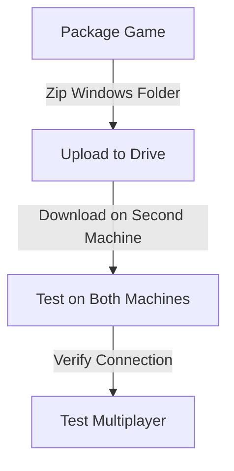
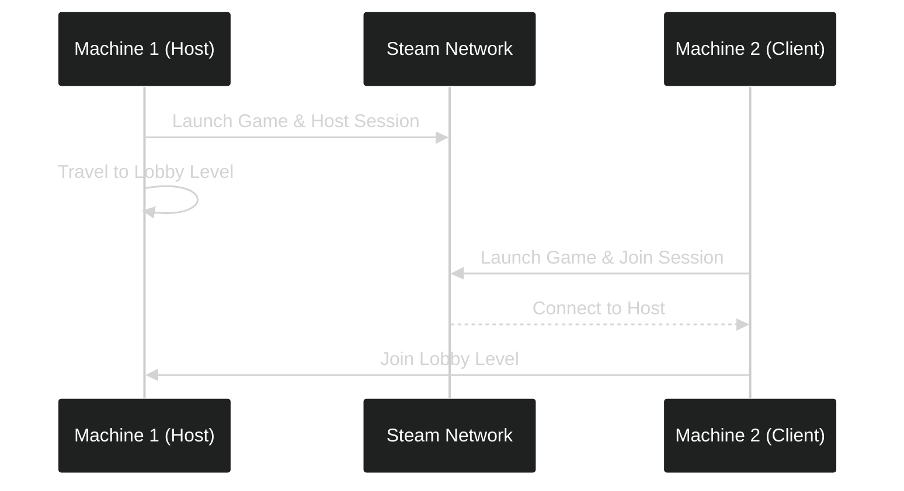
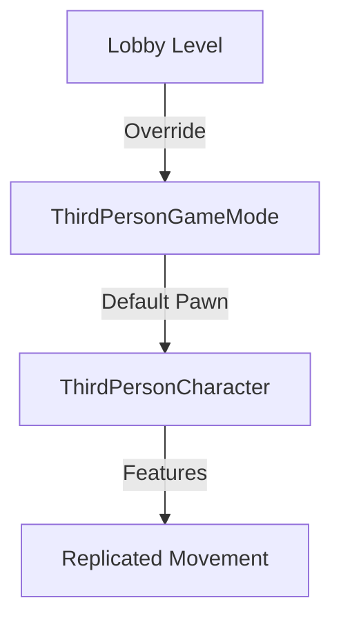

---
tags:
  - Testing
  - multiplayer
  - character_movement
  - packaging
  - steam
Date: 2024-12-22
---
## Overview
In this lecture, we test our multiplayer plugin by:
1. Packaging and distributing the game
2. Testing connections between two machines over Steam
3. Implementing proper character movement using the Third Person Template

---

## Package Distribution Workflow

### Steps for Distribution:
1. Navigate to project build folder
2. Locate Windows folder containing executable
3. Compress Windows folder to ZIP
4. Upload to file sharing service (e.g., Google Drive)
5. Download and extract on second machine

---

## Initial Connection Testing

### Test Environment Setup:
- Two separate machines
- Different Steam accounts on each machine
- Steam running on both systems

### Initial Limitations:
- Default pawn movement only
- Limited replication
- No graceful exit implementation

---

## Character Movement Implementation

### Adding Third Person Template:
1. Content Browser → Add → Add Feature or Content Pack
2. Select "Third Person Template Material"
3. Import into project

### Configuring Lobby Level:
1. Open Lobby map
2. Set Game Mode Override to ThirdPersonGameMode
3. Verify default pawn class is ThirdPersonCharacter

### Benefits:
- Pre-configured character movement
- Automatic movement replication
- Visual representation of other players

---

## Final Testing Process

1. Delete existing builds
2. Package updated project
3. Create new ZIP file
4. Upload and distribute
5. Test on both machines:
   - Host on one machine
   - Join from second machine
   - Verify character visibility
   - Confirm movement replication

### Success Criteria:
- Both players visible in game
- Movement replication working
- Successful connection across internet
- Steam session properly established

---

## Key Takeaways
- Successfully implemented cross-internet multiplayer
- Added visual character representation
- Verified movement replication
- Established foundation for future development
