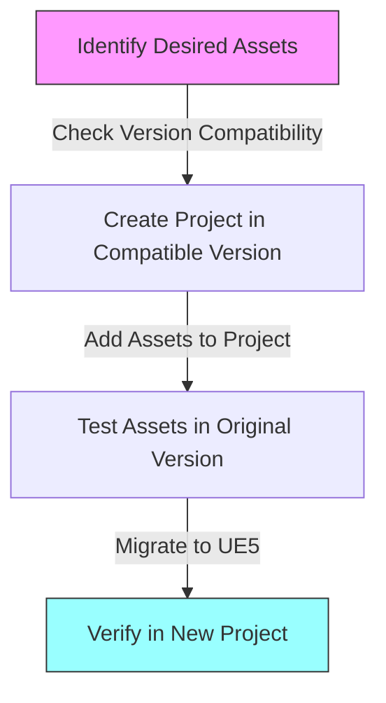
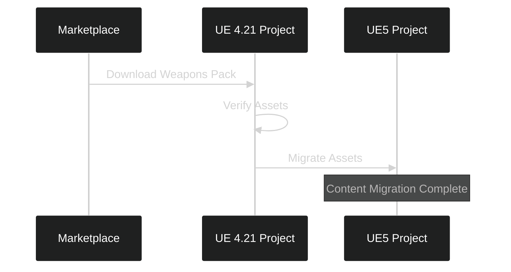
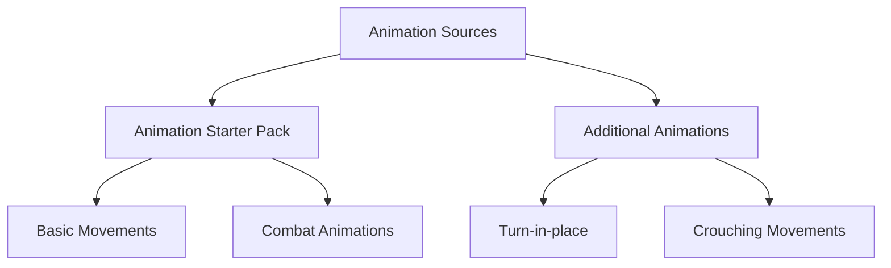

---
tags:
  - assets
  - migration
  - marketplace
  - animations
Date: 2024-12-22
---
I'll help create comprehensive instructional notes about acquiring and migrating game assets between different Unreal Engine versions. Let me organize this into a clear markdown document.
# Asset Migration and Management in Unreal Engine

## Overview 
This guide covers how to acquire and migrate assets between different Unreal Engine versions, specifically focusing on bringing older assets into UE5 projects. We'll explore obtaining weapons, environments, characters, and animations while managing version compatibility challenges.

---

## Asset Migration Workflow

The process of bringing assets from older engine versions into UE5 follows a specific pattern:

### Step-by-Step Migration Process:
1. Install compatible engine version
2. Create intermediary project
3. Add marketplace assets
4. Migrate to UE5 project

---

## Acquiring Core Assets

### Military Weapons Silver Pack
- Compatible with UE 4.4-4.21
- Contents:
  - Assault rifle
  - Pistol
  - Sniper rifle
  - Rocket launcher
  - Shotgun
  - Grenade launcher
- Includes particle systems and sounds

### Migration Steps for Weapons:
1. Create UE 4.21 project
2. Add weapons pack to project
3. Right-click on assets folder
4. Select "Migrate"
5. Choose UE5 content directory

---

## Environment and Character Assets

### Unreal Learning Kit
- Compatible with UE 4.26
- Provides:
  - Character models
  - Environmental assets
  - Basic animations
- Consistent art style across assets

### Animation Assets

Two primary animation sources:
1. **Animation Starter Pack**
   - Basic shooter animations
   - UE4 mannequin skeleton
   - Retargeting capabilities

2. **Additional Needed Animations**
   - Standing turn-in-place
   - Crouching turn-in-place
   - (To be covered in future lectures)

---

## Best Practices for Asset Management

1. **Version Compatibility**
   - Always check supported engine versions
   - Use intermediate projects for migration
   - Test assets before migration

2. **Project Organization**
   - Keep related assets together
   - Maintain clear folder structure
   - Document asset dependencies

3. **Migration Process**
   - Always migrate to content folder
   - Verify all dependencies are included
   - Test functionality after migration

---

## Key Takeaways
- Older assets can be used in UE5 through proper migration
- Multiple source projects may be needed for different assets
- Animation retargeting enables flexibility in character models
- Consistent art style important for visual cohesion
