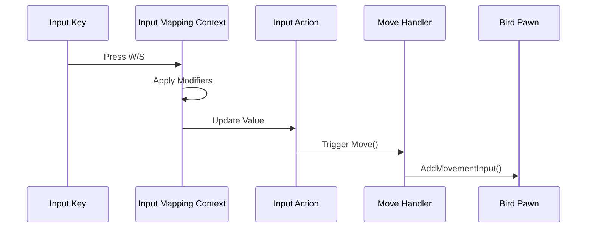

---
tags:
  - enhanced_input
  - youtube
  - input_system
  - game_development
Date: 2024-12-25
---
# Implementing Movement with Enhanced Input in UE5

[Youtube Video Link](https://www.youtube.com/watch?v=XPN7rzPR1H8)

---

## Understanding Movement in Games

Before we dive into implementation, let's understand what makes good movement feel responsive and natural. In games, movement is all about converting player intent (pressing keys) into character action in a way that feels immediate and precise.

The Enhanced Input system helps us achieve this by providing a flexible framework for processing and responding to player input. Let's build this system step by step.

---

## Project Foundation

First, we need to prepare our project with the right tools and configurations.

### Setting Up Your Project

Think of this like gathering your tools before starting construction. We need to ensure Enhanced Input is properly configured:

```cpp
// YourProject.Build.cs
PublicDependencyModuleNames.AddRange(new string[] 
{
    "Core",
    "CoreUObject",
    "Engine",
    "InputCore",
    "EnhancedInput"  // Our new tool for better input handling
});
```

---

## Building Our Character's Input System

### The Blueprint: Header File Setup

Just as a building needs a blueprint, our character needs a clear structure for handling input:

```cpp
// Bird.h
#pragma once

#include "CoreMinimal.h"
#include "GameFramework/Pawn.h"
#include "InputActionValue.h"
#include "Bird.generated.h"

// Forward declarations keep our code cleaner
class UInputMappingContext;
class UInputAction;

UCLASS()
class GAME_API ABird : public APawn
{
    GENERATED_BODY()

protected:
    // Core setup functions
    virtual void BeginPlay() override;
    virtual void SetupPlayerInputComponent(class UInputComponent* PlayerInputComponent) override;
    
    // Our main input handler
    void Move(const FInputActionValue& Value);

private:
    // Input configuration - these are like the control panel for our character
    UPROPERTY(EditAnywhere, BlueprintReadOnly, Category="Input", meta=(AllowPrivateAccess="true"))
    TObjectPtr<UInputMappingContext> BirdMappingContext;

    UPROPERTY(EditAnywhere, BlueprintReadOnly, Category="Input", meta=(AllowPrivateAccess="true"))
    TObjectPtr<UInputAction> MoveAction;
};
```

---

### The Implementation: Bringing It to Life

Now we'll implement our movement system. Think of this as installing the control system in our character:

```cpp
// Bird.cpp
#include "Bird.h"
#include "Components/InputComponent.h"
#include "EnhancedInputComponent.h"
#include "EnhancedInputSubsystems.h"

void ABird::BeginPlay()
{
    Super::BeginPlay();
    
    // Always validate our tools before using them
    check(BirdMappingContext);
    
    // Set up our input system - like connecting the controls to our character
    if (APlayerController* PlayerController = Cast<APlayerController>(GetController()))
    {
        if (UEnhancedInputLocalPlayerSubsystem* Subsystem = 
            ULocalPlayer::GetSubsystem<UEnhancedInputLocalPlayerSubsystem>(
                PlayerController->GetLocalPlayer()))
        {
            // Install our control scheme
            Subsystem->AddMappingContext(BirdMappingContext, 0);
        }
    }
}

void ABird::SetupPlayerInputComponent(UInputComponent* PlayerInputComponent)
{
    Super::SetupPlayerInputComponent(PlayerInputComponent);
    
    // Convert to our enhanced input component
    if (UEnhancedInputComponent* EnhancedInputComponent = 
        CastChecked<UEnhancedInputComponent>(PlayerInputComponent))
    {
        // Connect our movement action to its handler
        EnhancedInputComponent->BindAction(
            MoveAction,
            ETriggerEvent::Triggered,
            this,
            &ABird::Move);
    }
}

void ABird::Move(const FInputActionValue& Value)
{
    // Extract the actual movement value
    const float DirectionValue = Value.Get<float>();
    
    // Only move if we have meaningful input
    if (DirectionValue != 0.0f)
    {
        // Calculate and apply movement
        const FVector ForwardDirection = GetActorForwardVector();
        AddMovementInput(ForwardDirection, DirectionValue);
    }
}
```

---

## Creating the Control Scheme

### Organizing Input Assets

Create a clear folder structure for your input configuration:

```plaintext
Content/
  └── Input/
      ├── Actions/      // What the character can do
      └── IMC/          // How inputs map to actions
```

### Setting Up Movement Controls

Think of this like creating a control panel for your character:

1. Create an Input Action named `IA_Move`:
   - This defines what kind of movement we want
   - Set Type to `Axis 1D (Float)` for forward/backward movement

2. Create an Input Mapping Context named `IMC_Bird`:
   - This connects physical keys to our movement action
   - Think of it as wiring up the controls

---

### Understanding the Input Flow

Let's visualize how input travels through our system:



---

## Fine-Tuning the System

### Value Processing Pipeline

Understanding how input values flow through the system:

1. **Initial Input**:
   - W Key generates +1.0
   - S Key generates +1.0 (becomes -1.0 after modifier)

2. **Processing Stage**:
   - Values are normalized (-1.0 to +1.0)
   - Modifiers apply their transformations

3. **Final Application**:
   - Values scale movement direction
   - Movement is applied to character

---

## Testing and Verification

### Debug Tools

Enhanced Input provides excellent debugging tools:

```
showdebug enhancedinput
```

This reveals:
- Active control schemes (green)
- Current actions (yellow)
- Input values and timing
- Modifier effects

---

## Best Practices for Movement Implementation

### Input Processing

Always handle input values carefully:
- Check for non-zero values to avoid unnecessary processing
- Consider adding deadzones for analog input
- Validate input ranges for consistency

### Error Prevention

Protect your system:
- Verify all required components exist
- Validate input setup early
- Handle edge cases appropriately

### Code Organization

Keep your system maintainable:
- Separate input logic from movement calculations
- Use clear, consistent naming
- Document your modifier chains

---

## Troubleshooting Guide

### Movement Issues

If movement isn't working:
1. Verify input context is properly added
2. Check action bindings
3. Confirm modifier settings
4. Validate movement component setup

### Value Problems

For incorrect movement values:
1. Check modifier chain order
2. Verify axis settings
3. Validate raw input values

---

## Future Enhancements

Consider these advanced features for your movement system:

1. Full Directional Movement:
   - Add 2D axis support
   - Implement look/rotation controls
   - Add strafe movement

2. Advanced Features:
   - Sprint mechanics
   - Crouch system
   - Jump functionality

3. Input Customization:
   - Rebinding system
   - Multiple control schemes
   - Context-sensitive controls

Remember: Good movement is about feel. Test extensively and adjust based on player feedback.