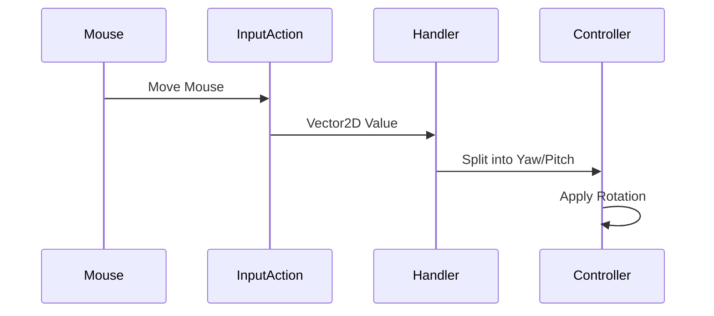

---
tags:
  - enhanced_input
  - youtube
  - game_development
  - input_system
Date: 2024-12-23
---
# Implementing 2D Input with Enhanced Input System in UE5

---

## Introduction

Moving from 1D to 2D input represents a significant step in creating more sophisticated character control. While our previous implementation handled simple forward/backward movement, we'll now implement full mouse-look functionality using Enhanced Input's 2D capabilities.

---

## Understanding 2D Input

Before diving into implementation, let's understand what makes 2D input different:

### 1D vs 2D Input
- 1D Input (Previous): Single float value (e.g., forward/backward movement)
- 2D Input (New): Vector2D with X and Y components (e.g., mouse movement)

Think of it like this:
- 1D is like a slider (forward/back)
- 2D is like a touchpad (both horizontal and vertical)

---

## Setting Up the Project

### Input Action Creation

1. Create a new Input Action asset named "IA_Look":
   - Right-click in Input/Actions folder
   - Select Input → Input Action
   - Set Value Type to "Axis 2D (Vector2D)"

This creates an input action capable of handling both X and Y mouse movement simultaneously.

### Input Mapping Context Configuration

In your IMC, add the new look action:

1. Add "IA_Look" to mappings
2. Select "Mouse XY 2D Axis" from Mouse options

```cpp
// The system will automatically map:
// Mouse X movement → Vector2D.X
// Mouse Y movement → Vector2D.Y
```

---

## C++ Implementation

### Header File Updates

First, we need to add our new input action variable:

```cpp
private:
    // Input configuration
    UPROPERTY(EditAnywhere, BlueprintReadOnly, Category="Input", meta=(AllowPrivateAccess="true"))
    TObjectPtr<UInputAction> LookAction;  // New 2D input action

    // Input handler
    void Look(const FInputActionValue& Value);  // New handler for 2D input
```

### Implementation File

```cpp
void ABird::Look(const FInputActionValue& Value)
{
    // Extract 2D vector from the input value
    const FVector2D LookAxisValue = Value.Get<FVector2D>();
    
    if (GetController())
    {
        // Apply yaw (left/right) rotation
        AddControllerYawInput(LookAxisValue.X);
        
        // Apply pitch (up/down) rotation
        AddControllerPitchInput(LookAxisValue.Y);
    }
}
```

### Binding the Input

In your SetupPlayerInputComponent:

```cpp
void ABird::SetupPlayerInputComponent(UInputComponent* PlayerInputComponent)
{
    Super::SetupPlayerInputComponent(PlayerInputComponent);
    
    if (UEnhancedInputComponent* EnhancedInputComponent = 
        CastChecked<UEnhancedInputComponent>(PlayerInputComponent))
    {
        // Bind our look action
        EnhancedInputComponent->BindAction(
            LookAction,
            ETriggerEvent::Triggered,
            this,
            &ThisClass::Look
        );
    }
}
```

---

## Fine-Tuning Mouse Control

### Understanding Mouse Input Flow



### Inverting Mouse Y-Axis

To fix inverted mouse look, add a Negate modifier in your IMC:

1. Add Negate modifier to IA_Look
2. Configure the modifier:
   - Uncheck X (keep horizontal movement as is)
   - Check Y (invert vertical movement)
   - Z doesn't matter for 2D input

---

## Debugging Your Implementation

### Using Enhanced Input Debug Tool

```plaintext
showdebug enhancedinput
```

This shows:
- Real-time Vector2D values
- Modifier effects
- Input triggering status

Watch for:
- X values when moving left/right
- Y values when moving up/down
- Any modifier effects

---

## Common Issues and Solutions

### Mouse Movement Not Working
- Check IMC priority settings
- Verify input action binding
- Confirm Mouse XY 2D Axis mapping

### Inverted Controls
- Review Negate modifier settings
- Check axis mapping configuration
- Verify Vector2D component usage

### Rotation Issues
- Confirm Controller settings
- Check UseControllerRotation settings
- Verify camera setup

---

## Best Practices

1. Input Value Processing
   - Always validate controller before use
   - Consider adding sensitivity controls
   - Handle edge cases gracefully

2. Code Organization
   - Keep input logic separate
   - Use clear naming conventions
   - Document modifier usage

3. Testing
   - Test with different mouse speeds
   - Verify edge-case behavior
   - Check modifier interactions

---

## Next Steps

Consider these enhancements:

1. Add mouse sensitivity controls
2. Implement rotation limits
3. Add smooth interpolation
4. Create different control schemes

Remember: Good mouse control is crucial for player experience. Take time to fine-tune your implementation and get player feedback.