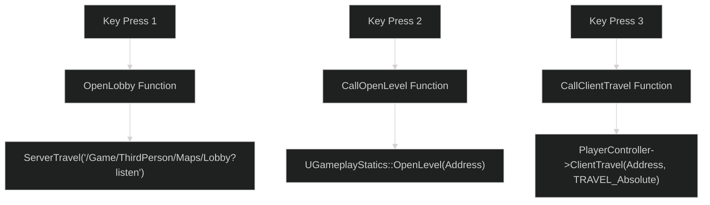
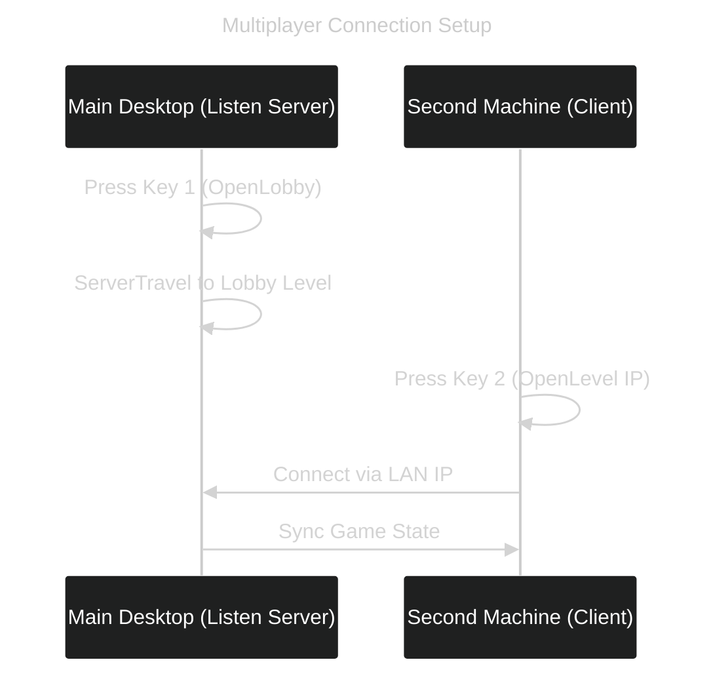

---
tags:
  - Testing
  - local_lan
  - Listen_Server
  - UProject
  - SLN
  - OpenLevel
  - GameplayStatics
  - FString
  - FName
  - servertravel
Date: 2024-12-15
---
# Unreal Engine Multiplayer Setup via C++  

This guide outlines the process of opening a multiplayer project in **C++**, creating key functions for **OpenLobby**, **OpenLevel**, and **ClientTravel**, and integrating them into the Character Blueprint.

---

## Step 1: Opening the Project in C++  

1. Open the project via either:  
   - **#SLN**: Open the project using the Visual Studio solution file.  
   - **#UProject**: Right-click the `.uproject` file and select **Generate Visual Studio Project Files**.  

2. Once inside the project, navigate to the **`MPTestCharacter.h`** file.

---

## Step 2: Adding Basic Functions in the Header File  

Inside the `public` section of `MPTestCharacter.h`, add the following **BlueprintCallable** functions:

```cpp
// MPTestCharacter.h

UFUNCTION(BlueprintCallable)  
void OpenLobby();  

UFUNCTION(BlueprintCallable)  
void CallOpenLevel(const FString& Address);  

UFUNCTION(BlueprintCallable)  
void CallClientTravel(const FString& Address);
```
## Step 3: Generating Function Definitions in the .cpp File

Navigate to **`MPTestCharacter.cpp`** and implement the corresponding function logic.

---

### **3.1: OpenLobby Function**

The `OpenLobby` function will use **`ServerTravel`** to load a specific level.

**Key Points:**

- You need the file path for the Lobby level.
- File paths are shortened using the `/Game` alias.

### **Example: File Path**

Full path: C:\3D_MultiplayerCourse\MPTest\Content\ThirdPerson\Maps\Lobby
Simplified path: /Game/ThirdPerson/Maps/Lobby

### Implementation

```cpp
void AMPTestCharacter::OpenLobby()  
{  
    UWorld* World = GetWorld();  
    if (World)  
    {  
        // Open the Lobby level as a Listen Server
        World->ServerTravel("/Game/ThirdPerson/Maps/Lobby?listen");  
    }
}
```

---
### **3.2: CallOpenLevel Function**

The `CallOpenLevel` function uses the **`UGameplayStatics::OpenLevel`** function to open a level.

**Key Points:**

- `OpenLevel` expects an **`FName`**, but `Address` is an **`FString`**.
- Use `*` to dereference the `FString` and convert it to a compatible `FName`.

**Implementation:**
```cpp
void AMPTestCharacter::CallOpenLevel(const FString& Address)
{
UGameplayStatics::OpenLevel(this, *Address);   
}

```
**Explanation:**

- `*Address`: Converts the `FString` value into an `FName` that `OpenLevel` requires.

---

### **3.3: CallClientTravel Function**

The `CallClientTravel` function is used on the **#PlayerController** to transition clients to a new level or server.

**Key Points:**

- ClientTravel allows for seamless client-side level transitions.
- Use `TRAVEL_Absolute` to ensure the path is treated as an absolute URL or file path.

**Implementation:**
```cpp
void AMPTestCharacter::CallClientTravel(const FString& Address)   
{
	APlayerController* PlayerController = GetGameInstance()->GetFirstLocalPlayerController();
	if (PlayerController)
	{
		PlayerController->ClientTravel(Address, TRAVEL_Absolute);
	} 
}
```
## Step 4: Adding Functions to the Character Blueprint

1. Open your **Character Blueprint** in Unreal Engine.
    
2. Replace any built-in functions with the new C++ functions:
    
    - **`OpenLobby()`**
    - **`CallOpenLevel()`**
    - **`CallClientTravel()`**
3. Map these functions to relevant input actions (e.g., key presses).
    

### Example Blueprint Mapping

|Key|Action|Function|
|---|---|---|
|**1**|Open Lobby Level as Listen Server|`OpenLobby()`|
|**2**|Open Level via IP|`CallOpenLevel()`|
|**3**|Client Travel to Address|`CallClientTravel()`|

---

## Visual Flowchart of Functionality

The following Mermaid diagram illustrates the logic flow of these three functions:




---

## Summary of Key Concepts

|Function|Purpose|Key Logic|
|---|---|---|
|**OpenLobby**|Opens a Lobby level as Listen Server|Uses `ServerTravel` to host the level.|
|**CallOpenLevel**|Opens a level via IP or address|Uses `UGameplayStatics::OpenLevel`.|
|**CallClientTravel**|Transitions client to new level|Uses `PlayerController::ClientTravel`.|

---

## Notes and Tips

1. **File Paths:**  
    Always use `/Game` as a shorthand for the `Content` directory.
    
2. **Dereferencing FString:**  
    Use `*` to convert `FString` to `FName` where necessary.
    
3. **Testing Multiplayer:**  
    Use **Play Modes** (Listen Server or Client) to test your implementation:
    
    - Editor instance runs as the server (Listen Server).
    - Other players act as clients.
4. **Blueprint Integration:**  
    Functions exposed with `BlueprintCallable` can be used seamlessly in Blueprints.
    

---

## Final Steps: Test the Setup

1. Package the game and share it to another computer on the same network.
2. **Main Desktop:**
    - Launch the game and press **1** to open the Lobby level as a Listen Server.
3. **Second Machine:**
    - Launch the game and press **2** to connect to the Listen Server using the LAN IP.

---

### Final Flowchart of Game Setup

