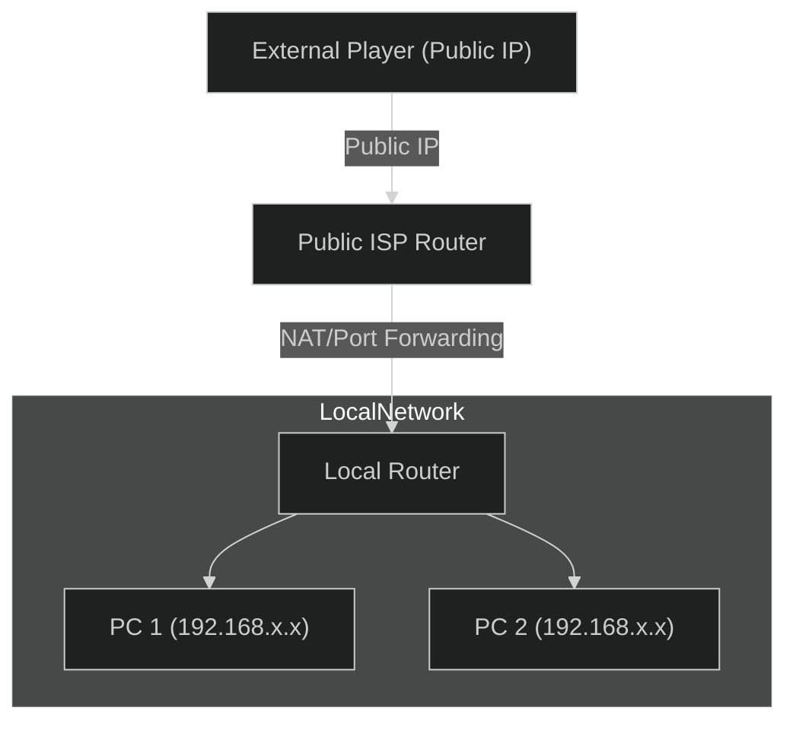
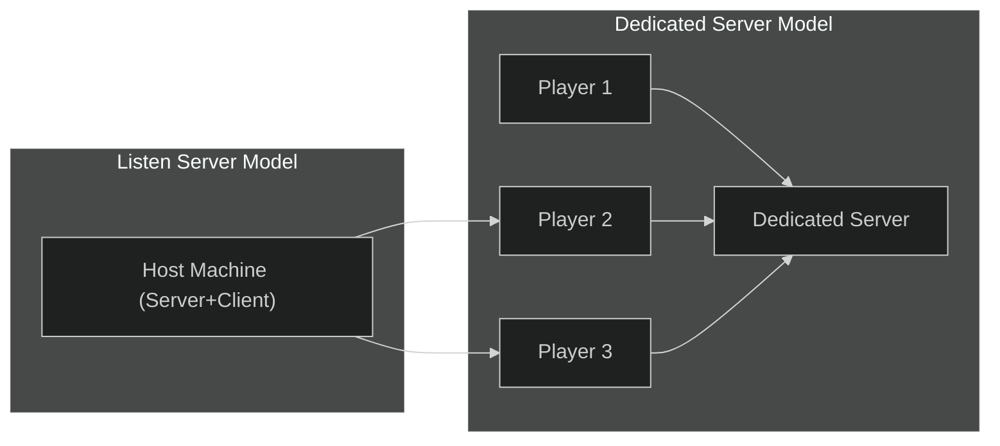

---
tags:
  - online_subsystem
  - steam
  - Dedicated_Server
  - Listen_Server
  - multiplayer
  - online_multiplayer
Date: 2024-12-15
---
# Unreal Engine Multiplayer: Local vs Public Connections and Online Subsystem Integration

This guide explores **local vs public connections**, compares **dedicated and listen servers**, and introduces Unreal Engine's **Online Subsystem**. We'll also cover creating a custom plugin for Steam integration.

---

## Local vs Public Connections  

Understanding the difference between local and public connections is essential for configuring multiplayer networking in Unreal Engine.

### **Local Connections**  

- **Definition:**  
  Connections that operate within your own router or firewall, typically on a **Local Area Network (LAN)**.  
  - Example: Playing with friends on the same Wi-Fi network.  

- **Characteristics:**  
  - Not accessible from outside the local network.  
  - Devices communicate using **local IPs** (e.g., `192.168.x.x` or `10.x.x.x`).  
  - Minimal latency as all communication occurs within the same physical network.  

- **Use Cases:**  
  - LAN parties.  
  - Testing multiplayer features without needing public exposure.  

---

### **Public Connections**  

- **Definition:**  
  Connections accessible from the **external internet**.  

- **Characteristics:**  
  - Devices communicate using **public IPs** assigned by the Internet Service Provider (ISP).  
  - Requires port forwarding or NAT configuration to allow external devices to connect.  

- **Use Cases:**  
  - Hosting games for players across the internet.  
  - Persistent servers for large-scale multiplayer experiences.  

---

### Visual Comparison: Local vs Public  

## Dedicated vs Listen Servers

Multiplayer games require a **server** to manage and synchronize game state across connected players. Unreal Engine supports two primary server types: **Dedicated** and **Listen**.

### **Dedicated Server**

- **Definition:**  
    A standalone server process that runs only the game logic without any player involvement.
    
- **Characteristics:**
    
    - Does **not render graphics**, reducing resource usage.
    - Acts as the authoritative source for all game logic and state.
    - Ideal for large-scale multiplayer games.
- **Pros:**
    
    - Equal latency for all players.
    - Better performance for large numbers of players.
- **Cons:**
    
    - Requires additional infrastructure (e.g., hosting on a cloud server).

---

### **Listen Server**

- **Definition:**  
    A player’s machine acts as both the **server** and a **client**.
    
- **Characteristics:**
    
    - The host player’s machine runs the server while simultaneously rendering the game.
    - Only one machine needs to handle both server and client logic.
- **Pros:**
    
    - Simple to set up.
    - No need for external hosting.
- **Cons:**
    
    - Host player has an unfair latency advantage.
    - If the host disconnects, the game ends for everyone.

---

### Visual Comparison: Dedicated vs Listen Servers

For more details on **Dedicated Servers** and **Listen Servers**, refer to the [Multiplayer Concepts](#multiplayer-concepts) section.

---

## Unreal Engine Online Subsystem

Unreal Engine’s **Online Subsystem** provides middleware for integrating third-party services like Steam, PlayStation Network, or Xbox Live. It simplifies implementing multiplayer features by offering a unified API for various platforms.

---

### **Benefits of the Online Subsystem**

1. **Platform Independence:**
    
    - The subsystem abstracts platform-specific APIs into a single interface.
    - Example: Switching from Steam to Epic Online Services requires minimal code changes.
2. **Login and Session Management:**
    
    - Built-in support for user authentication, matchmaking, and session creation.
3. **Middleware Integration:**
    
    - Unreal Engine handles much of the backend work, saving development time.

---

## Summary

|Feature|Local Connections|Public Connections|
|---|---|---|
|**Scope**|Within the same router|Across the internet|
|**IP Usage**|Local IP (192.168.x.x)|Public IP (ISP assigned)|
|**Setup Complexity**|Minimal|Requires NAT/port forwarding|

|Server Type|Dedicated|Listen|
|---|---|---|
|**Host**|Separate machine|Host player’s machine|
|**Performance**|High|Depends on host’s hardware|
|**Use Case**|Persistent multiplayer|Small-scale games|

|Online Subsystem Feature|Description|
|---|---|
|**Platform Support**|Steam, Epic, PSN, etc.|
|**Middleware**|Unified API for platforms|
|**Multiplayer Features**|Authentication, Sessions|