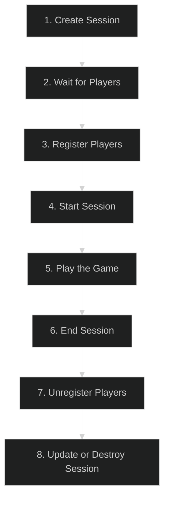
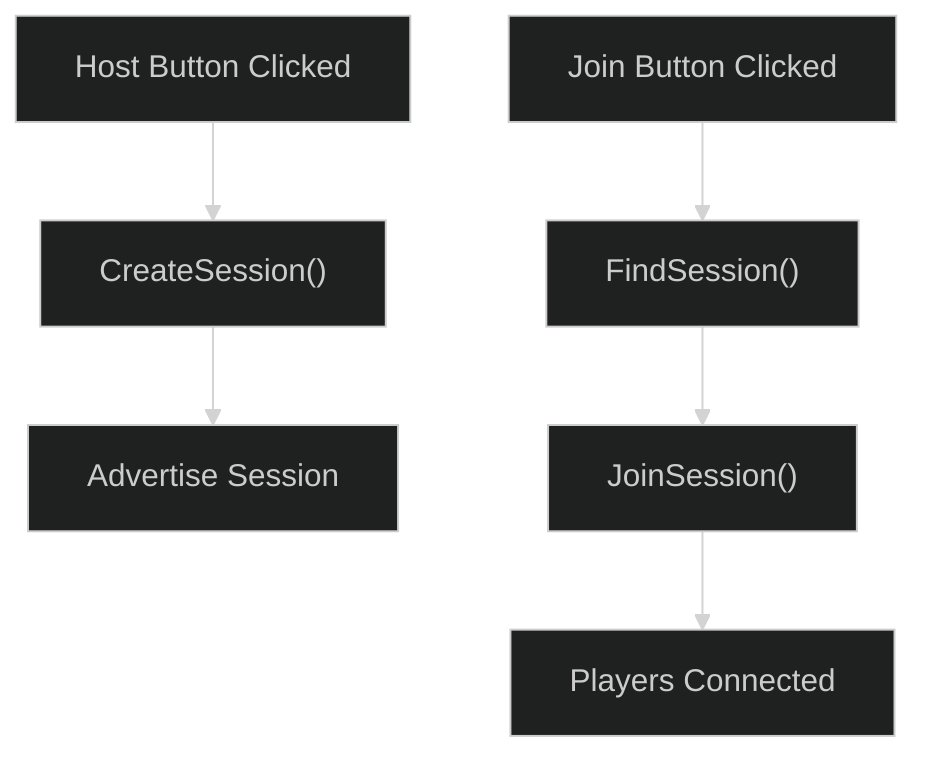

---
tags:
  - online_subsystem
  - steam
  - eos
  - multiplayer
  - session_interface
  - matchmaking
Date: 2024-12-15
---
# Unreal Engine Online Subsystem and Session Management

The **Online Subsystem** in Unreal Engine enables integration with online platforms like **Steam**, **Epic Online Services (EOS)**, and others. It acts as **middleware** to simplify multiplayer session creation and management.

---

## Online Subsystem Overview  

- The **Online Subsystem** serves as middleware between Unreal Engine and various online platforms.  
- Instead of implementing custom code for each platform, we **configure** the Online Subsystem in Unreal Engine.  

### Supported Platforms:
- Steam  
- Epic Online Services (EOS)  
- PlayStation Network  
- Xbox Live  

### Accessing the Online Subsystem  

You can access the Online Subsystem using the following C++ code:

```cpp
IOnlineSubsystem* Subsystem = IOnlineSubsystem::Get();
```

## Session Interface

The **Session Interface** in Unreal Engine provides the functionality to:

- **Create**, **manage**, and **destroy** online sessions.
- Search for available sessions.
- Enable **matchmaking**.

### Definition of a Session

A **session** represents an **instance of the game** running on the server.

- **Advertised Session**: Visible to others and open for players to join.
- **Private Session**: Requires an invite or direct connection to join.

---

## Session Life Cycle

The typical session life cycle involves the following stages:

1. **Create Session**
2. **Wait for Players to Join**
3. **Register Players**
4. **Start Session**
5. **Play the Game**
6. **End Session**
7. **Unregister Players**
8. **Update Session** or **Destroy Session**

---

### Visual Representation: Session Life Cycle


---

## Goal: Pairing Players with Host and Join Buttons

We will create two buttons in the game:

- **Host**: Creates a session.
- **Join**: Finds and joins an available session.

---

### Visual Flow: Host and Join Buttons



---

## Step-by-Step Workflow

1. **Host Button:**
    
    - Calls `CreateSession()` to host the game.
    - Advertises the session so other players can find it.
2. **Join Button:**
    
    - Calls `FindSession()` to search for available sessions.
    - If a session is found, calls `JoinSession()` to connect.
3. **Start Session:**
    
    - Once players are connected, call `StartSession()` to begin gameplay.
4. **Destroy Session:**
    
    - After the game ends, call `DestroySession()` to clean up resources.

---

## Summary

The **Online Subsystem** enables seamless integration with online platforms like Steam and Epic Online Services. By leveraging the **Session Interface**, we can create, find, and manage multiplayer sessions with minimal configuration.

|Function|Purpose|
|---|---|
|**CreateSession**|Creates and advertises a session.|
|**FindSession**|Searches for available sessions.|
|**JoinSession**|Connects players to a session.|
|**StartSession**|Begins gameplay.|
|**DestroySession**|Cleans up the session.|

With this setup, we can pair players together in a game with just two buttons: **Host** and **Join**.