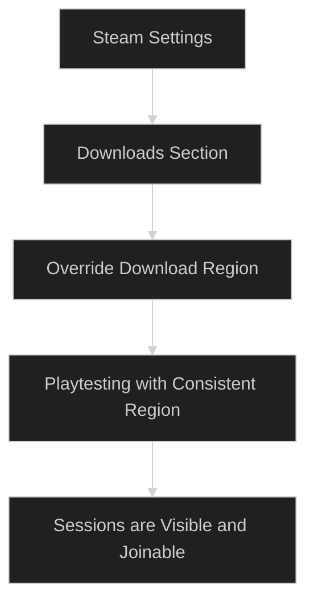

---
tags:
  - steam
  - multiplayer
  - steam_regions
  - Testing
Date: 2024-12-16
---
# Understanding Steam Regions for Multiplayer Testing

When using the **Steam Online Subsystem** in Unreal Engine, Steam utilizes **regional servers** to connect you to other players based on proximity. This is particularly important when playtesting your multiplayer games with sessions.

---

## Key Points About Steam Regions  

1. **Presence and Regions:**  
   Steam uses **presence** to match players in the **same region**. If two players are in different regions, they will not see or connect to each other's sessions.  

2. **Dev App ID 480 (Space War):**  
   When using Steam's **Dev App ID 480** (Space War), Steam will display your game under the Space War title in your Steam library.  
   - This is completely normal for development and testing purposes.  
   - It allows developers to use Steam's services without a custom App ID.

3. **Region Detection:**  
   Steam **automatically selects the nearest download region** for each user. This is used to connect players to the closest servers.  

---

## How to Verify and Override Steam Regions  

If you're playtesting with two machines or collaborating with someone in another city or country, follow these steps to ensure both players are in the **same Steam region**:

1. **Open Steam Settings:**
   - Launch the **Steam Client**.
   - Navigate to **Steam > Settings**.

2. **Find the Download Region:**
   - In the **Settings** menu, go to the **Downloads** section.  
   - Look for the **Download Region** option.  

3. **Set the Region Manually:**
   - By default, Steam auto-selects the nearest region (e.g., **US Phoenix**).  
   - To ensure consistency, **manually override** the region and set it to the **same location** on both machines.  

4. **Save and Restart Steam:**
   - After updating the region, restart the Steam client to apply the changes.  

---

## Example Scenario  

### Local Testing:  
If you are testing on two machines within the same house or network:  
- Steam will usually auto-select the same region. No manual changes are needed.  

### Remote Testing:  
If you are testing with someone across the country or globe:  
- Both users must **manually select the same region** (e.g., both set to **US Phoenix** or **EU Frankfurt**).  
- Without matching regions, sessions will not be visible to each other.  

---

## Visual Walkthrough  

