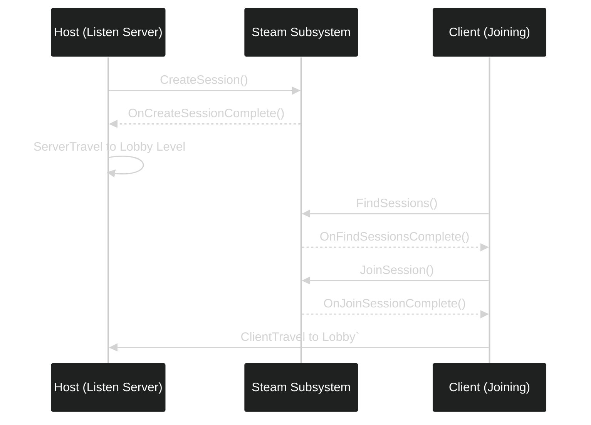

---
tags:
  - online_multiplayer
  - PlayerController
  - steam
  - steam_regions
Date: 2024-12-17
---
# Unreal Engine: Creating a Lobby Level and Managing Match Types

In this lecture, we will:

1. **Create a lobby level** for players to join after creating a session.
2. **Specify a match type** in session settings.
3. **Check match types** when finding sessions before joining.
4. **Implement client travel** to connect to the host's lobby level.

---

## Step 1: Create a Lobby Level

1. **Create a New Level:**
    - Go to **File > New Level > Default Level**.
2. **Adjust Level:**
    - Scale the floor: Set **X** and **Y** to `10`.
3. **Save the Level:**
    - Save it as `Lobby` under your `Maps` folder.

---

## Step 2: Travel to the Lobby After Creating a Session

Update the callback `OnCreateSessionComplete` to travel to the lobby level as a **listen server**.

### Update `.cpp` File

```cpp
void AMenuSystemCharacter::OnCreateSessionComplete(FName SessionName, bool bWasSuccessful)
{
    if (bWasSuccessful)
    {
        GEngine->AddOnScreenDebugMessage(-1, 15.f, FColor::Green, TEXT("Session Created Successfully"));
        
        // Get World and travel to the Lobby level
        UWorld* World = GetWorld();
        if (World)
        {
            World->ServerTravel(FString("/Game/ThirdPerson/Maps/Lobby?listen"));
        }
    }
    else
    {
        GEngine->AddOnScreenDebugMessage(-1, 15.f, FColor::Red, TEXT("Failed to Create Session"));
    }
}
```
---

## Step 3: Add Match Type to Session Settings

We will use the **`Set()`** function on `FOnlineSessionSettings` to define a **key-value pair** for the match type.

### Update `CreateGameSession`

Add the following under the session settings:
```cpp
SessionSettings->Set(FName("MatchType"), FString("FreeForAll"), EOnlineDataAdvertisementType::ViaOnlineServiceAndPing);
```

### Explanation:

- **Key:** `"MatchType"`
- **Value:** `"FreeForAll"`
- **Advertisement Type:** Makes the session discoverable.

---

## Step 4: Check Match Type When Finding Sessions

In the `OnFindSessionsComplete` callback, we will:

1. Retrieve the session's **match type**.
2. Compare it with the required match type (`FreeForAll`).
3. If it matches, join the session.

### Update `OnFindSessionsComplete`

```cpp
void AMenuSystemCharacter::OnFindSessionsComplete(bool bWasSuccessful)
{
    if (!OnlineSessionInterface.IsValid()) { return; }
    
    for (auto Result : SessionSearch->SearchResults)
    {
        FString Id = Result.GetSessionIdStr();
        FString User = Result.Session.OwningUserName;
        FString MatchType;
        
        // Retrieve MatchType from session settings
        Result.Session.SessionSettings.Get(FName("MatchType"), MatchType);
        
        if (MatchType == FString("FreeForAll"))
        {
            GEngine->AddOnScreenDebugMessage(-1, 15.f, FColor::Yellow,
                FString::Printf(TEXT("Joining Match: %s | User: %s"), *MatchType, *User));
            
            OnlineSessionInterface->AddOnJoinSessionCompleteDelegate_Handle(JoinSessionCompleteDelegate);
            const ULocalPlayer* LocalPlayer = GetWorld()->GetFirstLocalPlayerFromController();
            OnlineSessionInterface->JoinSession(*LocalPlayer->GetPreferredUniqueNetId(), NAME_GameSession, Result);
        }
    }
}
```
---

## Step 5: Travel to the Lobby When Joining a Session

The `OnJoinSessionComplete` callback will:

1. Get the **connection string** (IP address).
2. Use `ClientTravel` to join the host's session.

### Update `OnJoinSessionComplete`

```cpp
void AMenuSystemCharacter::OnJoinSessionComplete(FName SessionName, EOnJoinSessionCompleteResult::Type Result)
{
    if (!OnlineSessionInterface.IsValid()) { return; }

    FString Address;
    if (OnlineSessionInterface->GetResolvedConnectString(NAME_GameSession, Address))
    {
        GEngine->AddOnScreenDebugMessage(-1, 15.f, FColor::Yellow,
            FString::Printf(TEXT("Connect String: %s"), *Address));
        
        // Travel to the host's lobby level
        APlayerController* PlayerController = GetGameInstance()->GetFirstLocalPlayerController();
        if (PlayerController)
        {
            PlayerController->ClientTravel(Address, TRAVEL_Absolute);
        }
    }
    else
    {
        GEngine->AddOnScreenDebugMessage(-1, 15.f, FColor::Red, TEXT("Failed to Obtain Connect String"));
    }
}

```

---

## Visual Workflow


---

## Summary

- **Lobby Level:** Created and opened using `ServerTravel` for hosting.
- **Match Type:** Added to session settings as a key-value pair (`MatchType: FreeForAll`).
- **Session Validation:** Checked `MatchType` when searching for sessions.
- **Joining a Session:** Used `ClientTravel` to connect to the host's IP.