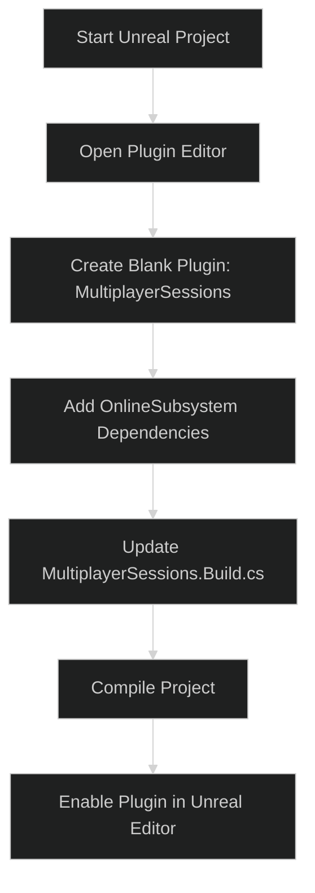

---
tags:
  - plugins
  - modules
  - online_subsystem
  - online_subsystem_steam
  - multiplayer
Date: 2024-12-17
---
# Creating a Plugin to Handle Multiplayer Sessions in Unreal Engine

In this guide, we will create a **plugin** for managing multiplayer session-related functionality. Plugins modularize your code, allowing functionality to be reused across multiple projects. We will also configure the plugin to use Unreal Engine's **Online Subsystem** to manage game sessions.

---

## Step 1: What is a Plugin?

A **plugin** in Unreal Engine is a modular, reusable unit of code designed for specific functionality. Plugins can be enabled or disabled at will and may depend on other modules, including engine plugins like **OnlineSubsystem**.

### Key Points:

- **Independent Modules**: Encapsulates functionality within its own build and source files.
- **Reuse**: Plugins can be shared and used across multiple projects.
- **Dependencies**: Plugins can depend on other plugins, like `OnlineSubsystem` and `OnlineSubsystemSteam`.

---

## Step 2: Creating the Plugin

1. Open your Unreal Engine project.
    
2. Go to **Edit > Plugins** in the Unreal Editor.
    
3. Click **New Plugin**.
    
4. Choose the **Blank Plugin** template.
    
5. Configure the plugin:
    
    - **Name**: `MultiplayerSessions`
    - **Author**: (Optional, add your name)
    - **Description**: A plugin for managing multiplayer sessions.
6. Click **Create Plugin**.
    

---

## Step 3: Verify Plugin Structure

The created plugin will appear in the project directory:

`<ProjectRoot>/Plugins/MultiplayerSessions/`

It will contain:

- `MultiplayerSessions.uplugin`: Plugin descriptor file.
- `Source/`: Code folders for the plugin.
    - `Public/`: Public headers.
    - `Private/`: Source files.
    - `MultiplayerSessions.Build.cs`: Build configuration.

---

## Step 4: Adding Dependencies

To use the Online Subsystem and Steam functionality, add the necessary dependencies.

### **4.1: Edit the Plugin Descriptor (.uplugin File)**

Open the `MultiplayerSessions.uplugin` file and include `OnlineSubsystem` and `OnlineSubsystemSteam` dependencies:

```json
{
  "FileVersion": 3,
  "Version": 1,
  "VersionName": "1.0",
  "FriendlyName": "MultiplayerSessions",
  "Description": "A plugin for handling multiplayer sessions.",
  "CreatedBy": "YourName",
  "Category": "Multiplayer",
  "Modules": [
    {
      "Name": "MultiplayerSessions",
      "Type": "Runtime",
      "LoadingPhase": "Default"
    }
  ],
  "Plugins": [
    {
      "Name": "OnlineSubsystem",
      "Enabled": true
    },
    {
      "Name": "OnlineSubsystemSteam",
      "Enabled": true
    }
  ]
}

```

---

### **4.2: Update Build Dependencies**

Edit the `MultiplayerSessions.Build.cs` file to include the required modules:

```json
using UnrealBuildTool;

public class MultiplayerSessions : ModuleRules
{
    public MultiplayerSessions(ReadOnlyTargetRules Target) : base(Target)
    {
        PCHUsage = PCHUsageMode.UseExplicitOrSharedPCHs;

        PublicDependencyModuleNames.AddRange(
            new string[]
            {
                "Core",
                "OnlineSubsystem",
                "OnlineSubsystemSteam"
            }
        );
    }
}

```

---

## Step 5: Compile the Plugin

1. Save the files.
2. Recompile the project:
    - In **Visual Studio**, press **Ctrl+Shift+B**.
3. After a successful build, confirm the plugin is compiled:
    - Check for the **`Binaries/`** and **`Intermediate/`** folders under the plugin directory.

---

## Step 6: Summary of Key Components

|**File**|**Purpose**|
|---|---|
|`MultiplayerSessions.uplugin`|Defines the plugin's metadata.|
|`MultiplayerSessions.Build.cs`|Adds module and dependency settings.|
|`Source/Public/`|Contains public header files.|
|`Source/Private/`|Contains implementation files.|
|`Binaries/`|Compiled plugin binaries.|

---

## Final Notes

- **Dependencies**: Ensure `OnlineSubsystem` and `OnlineSubsystemSteam` plugins are correctly configured and enabled.
- **Modularity**: Keeping multiplayer logic in a plugin makes the code cleaner, reusable, and easy to maintain.
- **Testing**: Use the new plugin in your project to test session creation and Steam integration.

---

## Visual Overview: Plugin Creation Workflow


