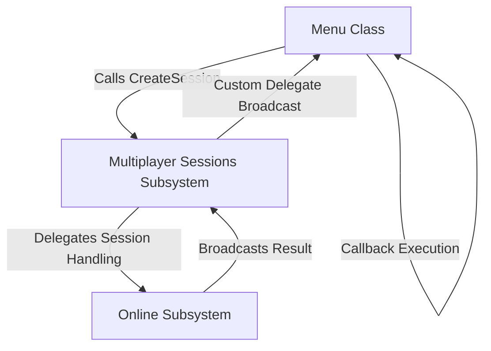

# Custom Delegates and Callbacks for Multiplayer Sessions Subsystem

## Key Concepts

- **Custom Delegates**:
  - Used to decouple subsystems by creating custom callbacks.
  - Ensures one-way dependency: Menu depends on Subsystem, but Subsystem does not depend on Menu.

- **Dynamic Multicast Delegates**:
  - Allows multiple bindings and can be broadcast.
  - Serializable and usable in Blueprints as Event Dispatchers.

---

## Implementation Steps

### Step 1: Declare Custom Delegate
- File: **`MultiplayerSessionsSubsystem.h`**
- Added custom delegate for session creation:

```cpp
DECLARE_DYNAMIC_MULTICAST_DELEGATE_OneParam(FMultiplayerOnCreateSessionComplete, bool, bWasSuccessful);

public:
    FMultiplayerOnCreateSessionComplete MultiplayerOnCreateSessionComplete;
```

---

### Step 2: Define Subsystem Callbacks
- File: **`MultiplayerSessionsSubsystem.cpp`**
- Updated `CreateSession` to broadcast delegate:

```cpp
void UMultiplayerSessionsSubsystem::CreateSession(int32 NumPublicConnections, FString MatchType) {
    if (!SessionInterface.IsValid()) return;

    auto ExistingSession = SessionInterface->GetNamedSession(NAME_GameSession);
    if (ExistingSession != nullptr) {
        SessionInterface->DestroySession(NAME_GameSession);
    }

    CreateSessionCompleteDelegateHandle = SessionInterface->AddOnCreateSessionCompleteDelegate_Handle(CreateSessionCompleteDelegate);
    
    LastSessionSettings = MakeShareable(new FOnlineSessionSettings());
    LastSessionSettings->NumPublicConnections = NumPublicConnections;
    LastSessionSettings->Set(FName("MatchType"), MatchType, EOnlineDataAdvertisementType::ViaOnlineServiceAndPing);

    const ULocalPlayer* LocalPlayer = GetWorld()->GetFirstLocalPlayerFromController();
    if (!SessionInterface->CreateSession(*LocalPlayer->GetPreferredUniqueNetId(), NAME_GameSession, *LastSessionSettings)) {
        SessionInterface->ClearOnCreateSessionCompleteDelegate_Handle(CreateSessionCompleteDelegateHandle);
        MultiplayerOnCreateSessionComplete.Broadcast(false);
    }
}

void UMultiplayerSessionsSubsystem::OnCreateSessionComplete(FName SessionName, bool bWasSuccessful) {
    if (SessionInterface) {
        SessionInterface->ClearOnCreateSessionCompleteDelegate_Handle(CreateSessionCompleteDelegateHandle);
    }

    MultiplayerOnCreateSessionComplete.Broadcast(bWasSuccessful);
}
```

---

### Step 3: Create Callback in Menu Class

#### Update Header
- File: **`Menu.h`**

```cpp
protected:
    UFUNCTION()
    void OnCreateSession(bool bWasSuccessful);
```

#### Update Implementation
- File: **`Menu.cpp`**

- Bind the callback:

```cpp
void UMenu::MenuSetup(int32 NumberOfPublicConnections, FString TypeOfMatch) {
    ...
    if (MultiplayerSessionsSubsystem) {
        MultiplayerSessionsSubsystem->MultiplayerOnCreateSessionComplete.AddDynamic(this, &ThisClass::OnCreateSession);
    }
}
```

- Define the callback function:

```cpp
void UMenu::OnCreateSession(bool bWasSuccessful) {
    if (bWasSuccessful) {
        if (GEngine) {
            GEngine->AddOnScreenDebugMessage(-1, 15.f, FColor::Green, TEXT("Session Created Successfully"));
        }
        GetWorld()->ServerTravel("/Game/ThirdPerson/Maps/Lobby?listen");
    } else {
        if (GEngine) {
            GEngine->AddOnScreenDebugMessage(-1, 15.f, FColor::Red, TEXT("Failed to Create Session"));
        }
    }
}
```

---

### Step 4: Adjust Host Button Logic
- File: **`Menu.cpp`**

```cpp
void UMenu::HostButtonClicked() {
    if (MultiplayerSessionsSubsystem) {
        MultiplayerSessionsSubsystem->CreateSession(NumPublicConnections, MatchType);
    }
}
```

---

### Step 5: Compile and Test

1. **Regenerate Visual Studio Project Files**:
   - Delete `Binaries` and `Intermediate` folders.
   - Right-click `.uproject` > Generate Visual Studio Project Files.

2. **Compile**:
   - Ensure no errors and recheck delegate binding if issues arise.

3. **Test in Game**:
   - Host a session and verify the debug message and level transition.

---

## Diagram: Delegate Workflow



---

### Summary

- Custom delegates decouple the subsystem and menu logic.
- Dynamic multicast delegates enable flexible callback binding.
- Testing ensures the session creation pipeline works end-to-end.

