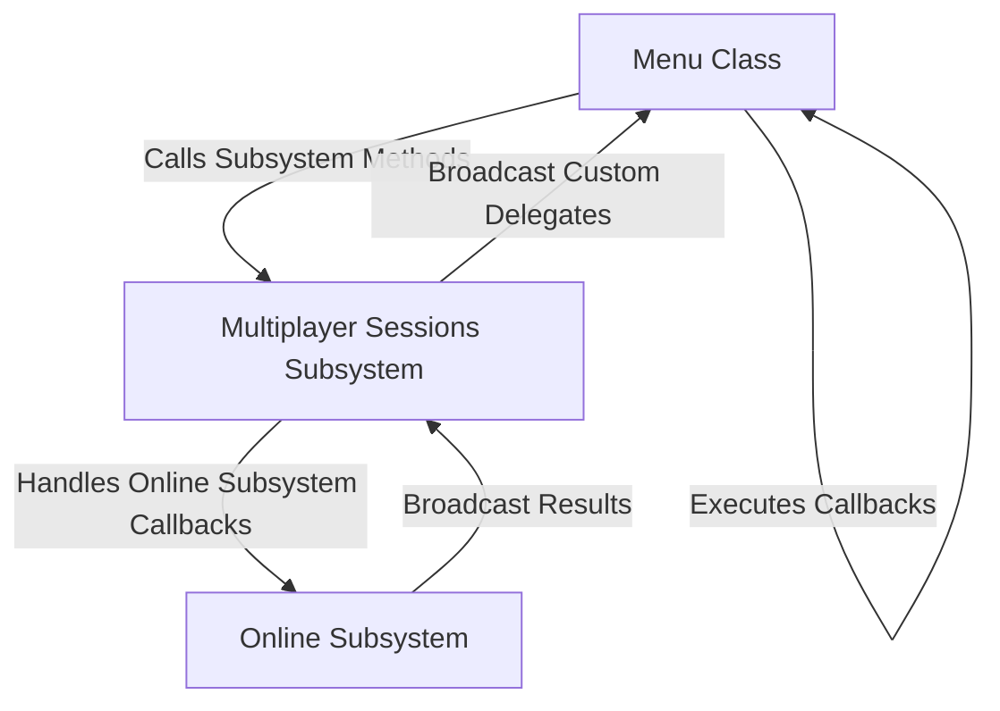

---
tags:
  - delegates
  - multiplayer
  - online_subsystem
  - callbacks
Date: 2024-12-18
---
# Lecture Notes: Custom Delegates and Callbacks for Multiplayer Sessions Subsystem

## Key Concepts

### What Are Custom Delegates?
- Custom delegates allow decoupling of code by enabling one part of the system (e.g., the **Multiplayer Sessions Subsystem**) to notify another part (e.g., the **Menu**) when specific events occur.
- This design ensures **one-way dependency**:
  - The Menu depends on the Subsystem, but the Subsystem does not rely on the Menu.

### Dynamic Multicast Delegates
- **Dynamic Multicast Delegates** are broadcast-style events that support:
  - Multiple bindings (listeners).
  - Serialization for Blueprint compatibility (usable in Event Dispatchers).

### Multicast Delegates (Non-Dynamic)
- Used for C++-only operations when the types being passed are not compatible with Unreal’s reflection system (e.g., `FOnlineSessionSearchResult`).

---

## Why These Changes Are Necessary

Multiplayer games rely on complex workflows involving creating, finding, joining, destroying, and starting sessions. Delegates simplify and centralize the communication of these events:

1. **Creating a Session**: Notify the menu if the session was created successfully or not.
2. **Finding Sessions**: Provide the search results back to the menu.
3. **Joining a Session**: Inform the menu whether joining was successful.
4. **Destroying a Session**: Let the menu know if a session was destroyed.
5. **Starting a Session**: Confirm to the menu if the session has started.

These callbacks make it easier to debug and extend functionality without tightly coupling the Subsystem and Menu.

---

## Implementation Steps

### Step 1: Declare Custom Delegates
- File: **`MultiplayerSessionsSubsystem.h`**
- The following delegates were added in the Subsystem:

```cpp
DECLARE_DYNAMIC_MULTICAST_DELEGATE_OneParam(FMultiplayerOnCreateSessionComplete, bool, bWasSuccessful);
DECLARE_MULTICAST_DELEGATE_TwoParams(FMultiplayerOnFindSessionsComplete, const TArray<FOnlineSessionSearchResult>& SessionResults, bool bWasSuccessful);
DECLARE_MULTICAST_DELEGATE_OneParam(FMultiplayerOnJoinSessionComplete, EOnJoinSessionCompleteResult::Type Result);
DECLARE_DYNAMIC_MULTICAST_DELEGATE_OneParam(FMultiplayerOnDestroySessionComplete, bool, bWasSuccessful);
DECLARE_DYNAMIC_MULTICAST_DELEGATE_OneParam(FMultiplayerOnStartSessionComplete, bool, bWasSuccessful);
```

### Why Dynamic vs. Non-Dynamic?
- **Dynamic Delegates**: Used for Blueprint-compatible parameters (e.g., `bool`).
- **Non-Dynamic Delegates**: Used for C++-specific types (e.g., `FOnlineSessionSearchResult`).

---

### Step 2: Add Delegate Variables to Subsystem
- File: **`MultiplayerSessionsSubsystem.h`**
- Public delegate variables for broadcasting events:

```cpp
FMultiplayerOnCreateSessionComplete MultiplayerOnCreateSessionComplete;
FMultiplayerOnFindSessionsComplete MultiplayerOnFindSessionsComplete;
FMultiplayerOnJoinSessionComplete MultiplayerOnJoinSessionComplete;
FMultiplayerOnDestroySessionComplete MultiplayerOnDestroySessionComplete;
FMultiplayerOnStartSessionComplete MultiplayerOnStartSessionComplete;
```

---

### Step 3: Handle Delegates in Subsystem Implementation
- File: **`MultiplayerSessionsSubsystem.cpp`**
- Current Implementation Status:

#### Create Session
- Successfully implemented with broadcasting:

```cpp
void UMultiplayerSessionsSubsystem::OnCreateSessionComplete(FName SessionName, bool bWasSuccessful) {
    if (SessionInterface) {
        SessionInterface->ClearOnCreateSessionCompleteDelegate_Handle(CreateSessionCompleteDelegateHandle);
    }

    MultiplayerOnCreateSessionComplete.Broadcast(bWasSuccessful);
}
```

#### Find, Join, Destroy, and Start Sessions
- Delegate handlers exist but have not been fully implemented yet:

```cpp
void UMultiplayerSessionsSubsystem::OnFindSessionComplete(bool bWasSuccessful) {
    // Implementation pending
}

void UMultiplayerSessionsSubsystem::OnJoinSessionComplete(FName SessionName, EOnJoinSessionCompleteResult::Type Result) {
    // Implementation pending
}

void UMultiplayerSessionsSubsystem::OnDestroySessionComplete(FName SessionName, bool bWasSuccessful) {
    // Implementation pending
}

void UMultiplayerSessionsSubsystem::OnStartSessionComplete(FName SessionName, bool bWasSuccessful) {
    // Implementation pending
}
```

> **Note**: These functions currently require logic for processing results and broadcasting events. Placeholders are present but incomplete.

---

### Step 4: Add Callbacks to Menu Class

#### Header Updates
- File: **`Menu.h`**
- Declared callback functions for all session operations:

```cpp
protected:
    UFUNCTION()
    void OnCreateSession(bool bWasSuccessful);
    void OnFindSessions(const TArray<FOnlineSessionSearchResult>& SessionResults, bool bWasSuccessful);
    void OnJoinSession(EOnJoinSessionCompleteResult::Type Result);
    UFUNCTION()
    void OnDestroySession(bool bWasSuccessful);
    UFUNCTION()
    void OnStartSession(bool bWasSuccessful);
```

#### Bind Callbacks in Implementation
- File: **`Menu.cpp`**
- Bound callbacks to the delegates in the `MenuSetup` function:

```cpp
if (MultiplayerSessionsSubsystem) {
    MultiplayerSessionsSubsystem->MultiplayerOnCreateSessionComplete.AddDynamic(this, &ThisClass::OnCreateSession);
    MultiplayerSessionsSubsystem->MultiplayerOnFindSessionsComplete.AddUObject(this, &ThisClass::OnFindSessions);
    MultiplayerSessionsSubsystem->MultiplayerOnJoinSessionComplete.AddUObject(this, &ThisClass::OnJoinSession);
    MultiplayerSessionsSubsystem->MultiplayerOnDestroySessionComplete.AddDynamic(this, &ThisClass::OnDestroySession);
    MultiplayerSessionsSubsystem->MultiplayerOnStartSessionComplete.AddDynamic(this, &ThisClass::OnStartSession);
}
```

---

### Step 5: Testing and Headers
- Ensure required headers for types like `FOnlineSessionSearchResult` and `EOnJoinSessionCompleteResult` are included:
  - `#include "OnlineSessionSettings.h"`
  - `#include "Interfaces/OnlineSessionInterface.h"`

---

## Delegate Workflow Diagram



---

## Summary

- Custom delegates were added for handling all session events.
- Current implementation focuses on session creation broadcasting.
- Placeholders for finding, joining, destroying, and starting sessions exist but require further logic.
- Callbacks in the Menu class were connected to subsystem events.

This structured approach simplifies debugging and ensures the code remains modular and extensible.

---