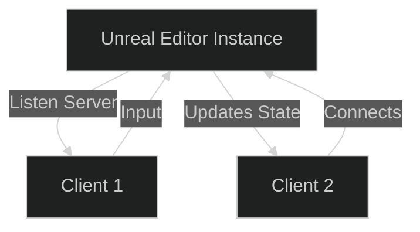
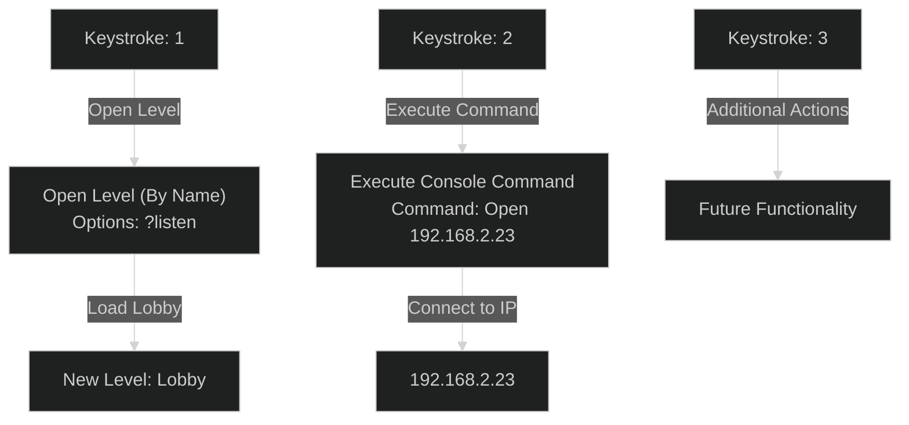
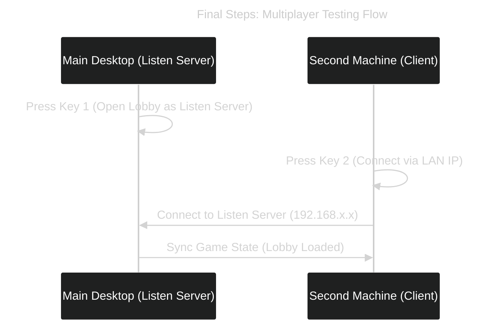

---
tags:
  - "#Testing"
  - local_lan
  - multiplayer
Date: 2024-12-15
---
# Unreal Engine Multiplayer Setup

This guide covers setting up a **multiplayer project** in Unreal Engine, creating sessions, configuring LAN connections, and using **Play Modes** like Listen Server, Dedicated Server, and Client.

---

## Step 1: Create a New Project

1. Open **Unreal Engine** and select the **Third Person Template**.
2. Create a new project named **MPTesting**.

### Why the Third Person Template?
The **Third Person Template** is an ideal starting point as it comes with:
- Character movement mechanics.
- Pre-configured Player Controller.
- Basic Blueprint setups for testing multiplayer.

---

## Step 2: Play Modes in Unreal Engine

Unreal Engine supports three primary **Play Modes** for testing multiplayer games:
1. **Standalone**  
2. **Listen Server**  
3. **Client**

To simulate multiplayer:
1. Go to **Play > Number of Players** and set it to a maximum of **4 clients/users**.
2. Switch between the modes using the **Play Mode** dropdown.

---

### Listen Server Mode

- The **Listen Server** acts as both the **server** and one of the **clients**.
- In the Editor, when using Listen Server mode, the Editor instance will always be the server.
- It allows testing with **2+ users** (players).

---

### Play as Client Mode

- Unreal Engine can **deploy a Dedicated Server** automatically.
- This allows clients to connect to a central server while separating the server instance from the player clients.

---

## Step 3: Local Area Network (LAN) Connection

In a **LAN multiplayer setup**, local IP addresses enable devices to connect seamlessly.

### Setup Steps:

1. Open the **Third Person Blueprint**.
2. Add logic for creating a session on a **keystroke**.

---

### Step 4: Create a New Level: Lobby

1. Create a new level named **Lobby**.
2. Use the **Basic Level** as the template.

---

### Step 5: Add Keystroke Actions

We'll set up **three keystrokes** (1, 2, and 3) to perform specific tasks.

---

### **1: Open Level by Name**

- Action: Pressing `1` will open a specified level.
- Node: **Open Level (By Name)**

#### Parameters:

|Parameter|Description|
|---|---|
|**Level Name**|The case-sensitive name of the level to load (e.g., `Lobby`).|
|**Absolute**|Determines whether to force an absolute path (requires more information for implementation).|
|**Options**|Add modifiers like `?listen` to open the level as a **Listen Server**.|

#### Blueprint Example:

plaintext

Copy code

`Open Level (By Name) - Level Name: "Lobby" - Options: "?listen"  --> Opens as Listen Server`

**Explanation of Options:**

- `?listen` : Opens the level with the server acting as a Listen Server.

---

### **2: Execute Console Command**

- Action: Pressing `2` will run a console command to **open a connection** to an IP address.
- Node: **Execute Console Command**

#### Parameters:

|Parameter|Description|
|---|---|
|**Command**|Allows passing console commands like `Open 192.168.2.23`.|

#### Console Command Example:

plaintext

Copy code

`Open 192.168.2.23`

**What This Does:**

- Opens a session and connects to the specified **local IP** (e.g., `192.168.2.23`).

---

### **3: Additional Action Placeholder**

You can expand this section to include other functionalities, such as:

- **Finding sessions.**
- **Joining existing sessions.**
- **Starting a dedicated server.**

Example ideas:

- Open a menu for session selection.
- Use **Find Session** and **Join Session** nodes to automate connections.

---

## Visual Blueprint Flow Example

Here's a visual representation of the keystroke actions and their effects:

---
## Final Steps: Package and Share the Game

1. **Package the Game:**
    
    - Go to **File > Package Project > Windows** (or your target platform).
    - Unreal Engine will create a packaged executable version of your project.
2. **Share the Game:**
    
    - Copy the packaged game folder to another computer on the same network.
3. **Launch the Game:**
    
    - On the **main desktop**, launch the game and press the `1` key to **open the Lobby level** as a Listen Server.
    - On the **second machine**, launch the game and press the `2` key to **connect** to the Listen Server using the LAN IP.

---

## Summary of Key Concepts

|Feature|Description|
|---|---|
|**Listen Server**|Acts as both the server and one of the clients.|
|**Dedicated Server**|Unreal Engine deploys a separate server instance for clients to connect to.|
|**LAN Connection**|Use local IPs for fast and seamless multiplayer connections.|
|**Console Commands**|Use `Execute Console Command` to connect to IPs and open levels.|
|**Open Level by Name**|Loads a specified level and can include `Options` for custom parameters.|
