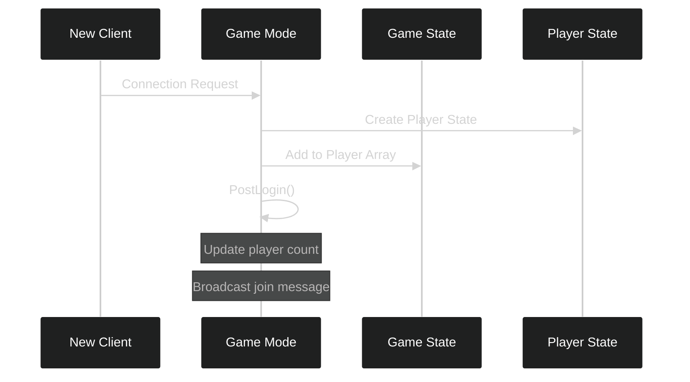
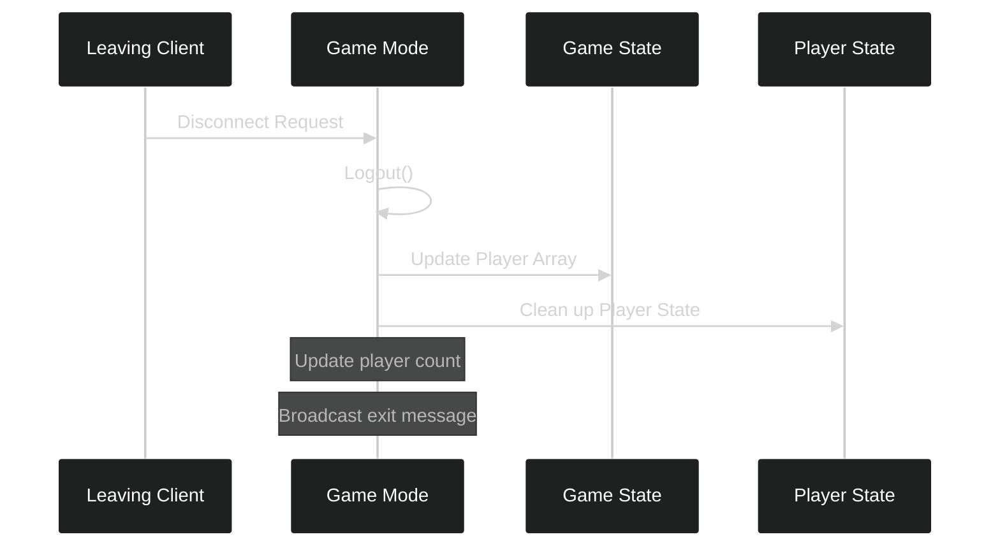

---
tags:
  - gamemode
  - multiplayer
  - player_tracking
  - networking
  - online_multiplayer
Date: 2024-12-19
---
# Game Modes and Player Tracking in Unreal Engine

## Understanding the Multiplayer Framework

Before diving into specific implementations, it's crucial to understand how Unreal Engine structures its multiplayer framework. Think of it as a theater production, where different roles and systems work together to create a seamless performance.

---

## Core Concepts: The Theater Analogy

In a theater production, multiple roles work together to create a successful show. Similarly, Unreal Engine's multiplayer system uses several components that each serve specific purposes:

- **Game Mode** (Theater Director): Manages the rules and oversees the entire production
- **Game State** (Stage Manager's Clipboard): Keeps track of the overall production state
- **Player State** (Actor's Script): Contains individual performer information

This separation of concerns allows for better organization and more efficient networking.

---

## Component Relationships and Responsibilities

Understanding how these components interact is crucial for effective multiplayer development. Here's how each piece fits into the larger picture:

| Component | Purpose | Network Role | Example Usage |
|-----------|---------|--------------|---------------|
| Game Mode | Rules enforcement, player management | Server-only | Player login/logout, spawn points |
| Game State | Shared game information | Replicated to all clients | Player count, game phase |
| Player State | Individual player data | Replicated per player | Player name, score |

---

## Player Management Flow

### Player Join Process

When a new player connects to our game, several systems work together to ensure proper integration. Let's examine this process in detail:



This process involves several key steps:
1. Initial connection request from the client
2. Game Mode creates necessary player information
3. Player is registered in the game state
4. Confirmation and setup completion

Here's how we implement this in code:

```cpp
void AMenuSystemGameMode::PostLogin(APlayerController* NewPlayer)
{
    Super::PostLogin(NewPlayer);  // Always call parent implementation first

    if (GameState)
    {
        // Get current player count
        int32 NumberOfPlayers = GameState.Get()->PlayerArray.Num();
        
        // Update display and handle new player
        if (GEngine)
        {
            GEngine->AddOnScreenDebugMessage(
                1,  // Unique key for updating message
                30.f,  // Display duration
                FColor::Yellow,
                FString::Printf(TEXT("Players In Game: %d"), NumberOfPlayers)
            );
        }
    }
}
```

---

## Player Exit Handling

When players leave the game, we need to ensure proper cleanup and state updates. This process is just as important as joining:



Implementation of the logout process:

```cpp
void AMenuSystemGameMode::Logout(AController* Exiting)
{
    Super::Logout(Exiting);
    
    // Update player count and handle cleanup
    if (GameState)
    {
        int32 NumberOfPlayers = GameState.Get()->PlayerArray.Num() - 1;
        
        // Display updated count
        if (GEngine)
        {
            GEngine->AddOnScreenDebugMessage(
                1,
                30.f,
                FColor::Yellow,
                FString::Printf(TEXT("Players In Game: %d"), NumberOfPlayers)
            );
        }
    }
}
```

---

## Session Configuration and Management

### Build Identification System

To ensure proper session management across different game builds, we implement a build identification system:

```cpp
// In session settings configuration
LastSessionSettings->BuildUniqueId = 1;
```

This setting serves several crucial purposes:
- Allows different builds to locate each other
- Enables testing with multiple instances
- Prevents version mismatch issues

### Player Limit Configuration

We can control player limits through different configuration levels:

```ini
[/Script/Engine.GameSession]
MaxPlayers=100
```

| Setting | Purpose | Configuration Location |
|---------|----------|----------------------|
| MaxPlayers | Global game player limit | DefaultGame.ini |
| NumPublicConnections | Session-specific limit | Session Settings |
| BuildUniqueId | Build version control | Session Settings |

---

## Testing and Verification

To ensure your player tracking system works correctly:

1. Test with multiple clients:
   - Package your game
   - Run multiple instances
   - Verify player count updates

2. Verify player state cleanup:
   - Monitor memory usage
   - Check for proper player removal
   - Ensure count accuracy

