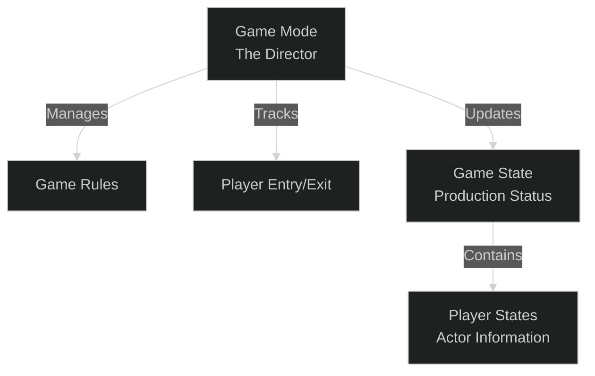
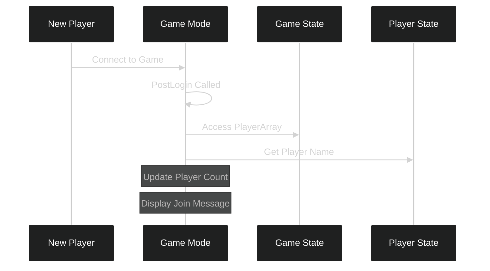
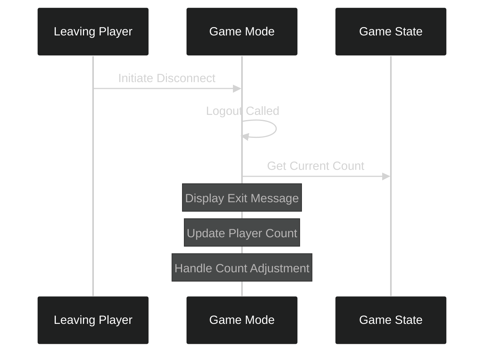

---
tags:
  - gamemode
  - multiplayer
  - player_tracking
  - networking
  - online_multiplayer
Date: 2024-12-19
---
# Game Mode and Player Tracking in Unreal Engine
#gamemode #multiplayer #player_tracking #unreal_engine #networking

## Core Concepts: The Director's Room

In multiplayer games, two key classes work together like a theater production's management team. Understanding their relationship is crucial for implementing proper player tracking.



In this system:
- Game Mode acts as the Director, managing rules and player flow
- Game State maintains current production status, like a stage manager's clipboard
- Player States hold individual information, similar to actor profiles

---

## Understanding the Game Mode's Role

The Game Mode serves as our game's director, handling critical responsibilities:

| Responsibility    | Purpose                      | Example                         |
| ----------------- | ---------------------------- | ------------------------------- |
| Game Rules        | Define how the game operates | Level transitions, spawn points |
| Player Management | Track player entry and exit  | PostLogin, Logout handling      |
| State Updates     | Keep player counts accurate  | Updating GameState              |

---

## Player Join Process Visualization

When a new player joins our game, several steps occur in sequence. Think of it like a new actor joining an ongoing theater production:



This process is implemented in our PostLogin function:

```cpp
void ALobbyGameMode::PostLogin(APlayerController* NewPlayer)
{
    Super::PostLogin(NewPlayer);  // Always call parent first

    if (GameState)
    {
        // Get current player count from GameState
        int32 NumberOfPlayers = GameState.Get()->PlayerArray.Num();

        if (GEngine)
        {
            // Display updated player count
            GEngine->AddOnScreenDebugMessage(
                1,  // Key for message updating
                30.f,  // Message duration
                FColor::White,
                FString::Printf(TEXT("Players In Game: %d"), NumberOfPlayers)
            );

            // Get and display new player's name
            APlayerState* PlayerState = NewPlayer->GetPlayerState<APlayerState>();
            if (PlayerState)
            {
                FString PlayerName = PlayerState->GetPlayerName();
                GEngine->AddOnScreenDebugMessage(
                    1,
                    30.f,
                    FColor::White,
                    FString::Printf(TEXT("%s has joined the game"), *PlayerName)
                );
            }
        }
    }
}
```

---

## Player Exit Flow

When a player leaves our game, we need to maintain accurate tracking. This process is similar to an actor leaving a production:



The implementation shows how we handle this process:

```cpp
void ALobbyGameMode::Logout(AController* Exiting)
{
    Super::Logout(Exiting);
    
    if (GEngine)
    {
        // Display who's leaving
        APlayerState* PlayerState = Exiting->GetPlayerState<APlayerState>();
        if (PlayerState)
        {
            FString PlayerName = PlayerState->GetPlayerName();
            GEngine->AddOnScreenDebugMessage(
                1,
                30.f,
                FColor::White,
                FString::Printf(TEXT("%s has left the game"), *PlayerName)
            );
        }

        // Update player count with adjustment
        int32 NumberOfPlayers = GameState.Get()->PlayerArray.Num();
        GEngine->AddOnScreenDebugMessage(
            2,
            30.f,
            FColor::White,
            FString::Printf(TEXT("Players In Game: %d"), NumberOfPlayers - 1)
        );
    }
}
```

---

## Debug Message System

Understanding how our debug messages work is crucial for development:

| Message Key | Duration   | Purpose                     |
| ----------- | ---------- | --------------------------- |
| 1           | 30 seconds | Updates existing messages   |
| -1          | 15 seconds | Creates new message entries |

The key of 1 ensures our player count and status messages update in place rather than creating a stack of messages.

---

## Blueprint Setup Process

To implement this system in your game:

1. Create a Blueprint class based on our LobbyGameMode
2. Set the default pawn class to BP_ThirdPersonCharacter:
   - This ensures proper movement replication
   - The default pawn doesn't replicate movement
3. Configure the Lobby level:
   - Set Game Mode Override to our Blueprint
   - Ensure proper player spawning

