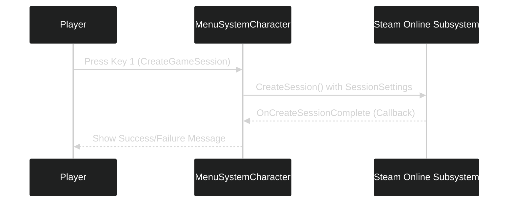

---
tags:
  - unreal_engine
  - cpp
  - delegates
  - online_subsystem
  - steam
  - session_management
  - ue_logs
---

# Unreal Engine: Understanding Delegates and Creating a Game Session

In this guide, we will explain **delegates**, demonstrate how they work, and integrate them into our multiplayer system to create a **game session** using the Online Subsystem.

---

## What is a Delegate?

A **delegate** in Unreal Engine is an object that holds a **reference to a function**. Delegates are often used as **event broadcasters**, notifying bound functions (callbacks) when certain events occur.

### Key Characteristics:
- **Binding Functions:** Delegates can bind functions (callbacks) to be executed when the delegate fires (broadcasts).
- **Event-Driven:** They are ideal for handling asynchronous tasks or responding to specific events like session creation or destruction.

---

### Example of a Delegate

Here is a simple example of a delegate in Unreal Engine:

```cpp
DECLARE_DELEGATE(FExampleDelegate);

class MyClass
{
public:
    FExampleDelegate OnEvent; // Declare a delegate instance

    void TriggerEvent()
    {
        if (OnEvent.IsBound())
        {
            OnEvent.Execute(); // Call the bound function
        }
    }
};

// Usage
void MyCallbackFunction()
{
    UE_LOG(LogTemp, Warning, TEXT("Event Triggered!"));
}

void TestDelegate()
{
    MyClass Obj;
    Obj.OnEvent.BindStatic(&MyCallbackFunction); // Bind a callback
    Obj.TriggerEvent(); // Triggers the callback
}
```
## Workflow: Creating a Game Session

The **Online Session Interface** uses delegates to notify us when an online session has been successfully created. Below is the workflow:

1. **Define and Bind a Delegate** (`FOnCreateSessionCompleteDelegate`).
2. **Create a Callback Function** (`OnCreateSessionComplete`).
3. **Call `CreateSession()`** to create a session.
4. The callback function executes when the session creation completes.

---

## Step 1: Add the Delegate and BlueprintCallable Function

Update your **`MenuSystemCharacter.h`** file with the following additions:

```cpp
#include "OnlineSubsystem.h"
public:
// Pointer to the online session interface       
IOnlineSessionPtr OnlineSessionInterface;    
protected:       
UFUNCTION(BlueprintCallable)       
void CreateGameSession();        
void OnCreateSessionComplete(FName SessionName, bool bWasSuccessful);    
private:       
FOnCreateSessionCompleteDelegate CreateSessionCompleteDelegate;  
```

---

## Step 2: Initialize the Delegate

In the **constructor** of `MenuSystemCharacter.cpp`, bind the callback function to the delegate:
```cpp
AMenuSystemCharacter::AMenuSystemCharacter() :
CreateSessionCompleteDelegate(FOnCreateSessionCompleteDelegate::CreateUObject(this, &AMenuSystemCharacter::OnCreateSessionComplete)) 
{    
// Initialize Online Subsystem and Session Interface     
IOnlineSubsystem* OnlineSubsystem = IOnlineSubsystem::Get();     
if (OnlineSubsystem)     
{         
OnlineSessionInterface = OnlineSubsystem->GetSessionInterface();         
UE_LOG(LogTemp, Warning, TEXT("Found Subsystem: %s"), *OnlineSubsystem->GetSubsystemName().ToString());     
}     
else     
{         
UE_LOG(LogTemp, Error, TEXT("No Online Subsystem Found!"));     
} 
}
```

---

## Step 3: Implement `CreateGameSession`

In `MenuSystemCharacter.cpp`, implement the **CreateGameSession** function:

```cpp
void AMenuSystemCharacter::CreateGameSession()  
{  
    // Called when pressing the 1 key  
    if (!OnlineSessionInterface.IsValid()) { return; }  
    auto ExistingSession = OnlineSessionInterface->GetNamedSession(NAME_GameSession);  
    if (ExistingSession != nullptr)  
    {       OnlineSessionInterface->DestroySession(NAME_GameSession);  
    }    OnlineSessionInterface->AddOnCreateSessionCompleteDelegate_Handle(CreateSessionCompleteDelegate);  
    TSharedPtr<FOnlineSessionSettings> SessionSettings = MakeShareable(new FOnlineSessionSettings()) ;  
    SessionSettings->bIsLANMatch=false;  
    SessionSettings->NumPublicConnections = 10;  
    SessionSettings->bAllowJoinInProgress = true;  
    SessionSettings->bAllowJoinViaPresence =true;  
    SessionSettings->bShouldAdvertise = true;  
    SessionSettings->bUsesPresence = true;  
    const ULocalPlayer* LocalPlayer = GetWorld()->GetFirstLocalPlayerFromController();  
    OnlineSessionInterface->CreateSession(*LocalPlayer->GetPreferredUniqueNetId(),NAME_GameSession, *SessionSettings);  
}
```
---

## Step 4: Implement the Callback Function

The callback function **`OnCreateSessionComplete`** is triggered when the session is successfully created. Add this to your `.cpp` file:

```cpp
void AMenuSystemCharacter::OnCreateSessionComplete(FName SessionName, bool bWasSuccessful)  
{  
    if (bWasSuccessful)  
    {       if (GEngine)  
          {          GEngine->AddOnScreenDebugMessage(-1,15.f,FColor::Green,FString::Printf(TEXT("CREATED SESSION: %s"), *SessionName.ToString()));  
       }    }    else  
    {  
       if (GEngine)  
       {          GEngine->AddOnScreenDebugMessage(-1,15.f,FColor::Red,FString(TEXT("FAILED TO CREATE SESSION")));  
       }    }}
```

---

## Summary of Key Concepts

|**Component**|**Purpose**|
|---|---|
|**Delegate**|Broadcasts events (e.g., session creation completion).|
|**Callback Function**|Handles the event when the delegate broadcasts.|
|`FOnCreateSessionCompleteDelegate`|Delegate type for handling session creation responses.|
|`CreateSession()`|Function to create a session.|
|**Session Settings**|Configures properties like LAN mode, public connections, and advertisements.|

---

## Visual Representation of Workflow




---

## Final Notes

- **Delegates** allow Unreal Engine to handle asynchronous tasks efficiently.
- We use `CreateSession()` to request session creation and `OnCreateSessionComplete()` as a callback to confirm success or failure.
- This structure will form the foundation for managing game sessions, and we will build on this in subsequent sections.

---

Test the functionality:

1. Press **1 Key** to trigger `CreateGameSession`.
2. Verify the success or failure message on the screen.
3. Ensure Steam is running for proper testing.